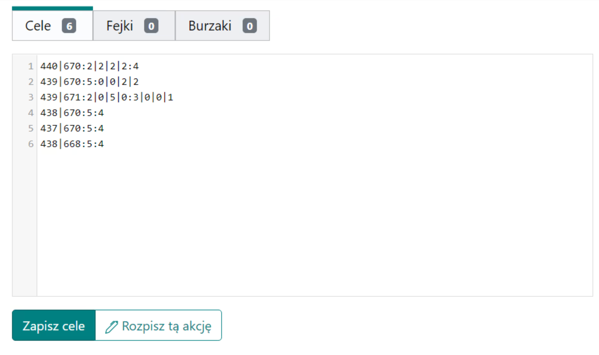

# Írja be a terv célpontjait

Konvenció: a további akció célpontjait a Célpontok egymást követő soraiba kell beírni. Minimum a koordináták önmagukban elegendőek, ebben az esetben egy példa sor `000|000` `000|000:0:0`-ra lesz kiegészítve. Később megtanulja, hogyan kódolja a támadások és a nemesek számát. A célpontok mentéséhez kattintson a Célpontok mentése gombra.

<figure markdown="span">
  { width="600" }
  <figcaption>1. példa, a támadások és a nemesek alapértelmezés szerint kódolva</figcaption>
</figure>

`440|670:5:4` az első sorban egy példa arra, hogyan kódoljuk a támadások és a nemesek számát egy adott célpontra alapértelmezés szerint. Az első szám a támadások számát, a második szám a nemesek számát jelöli.

A Tervező háromféle célpontot támogat: valós, hamis és rombolás. Helyezze a valós célpontokat a Célpontokba, a hamis célpontokat a Hamisakba, és a rombolási célpontokat a Rombolásokba. A Hamisak esetében a támadások és a nemesek helyett a hamis támadások és a hamis nemesek számát kódolja, a Rombolások fülön pedig a támadások számát és a rombolások számát (amelyek a támadásokat követik).

<figure markdown="span">
  { width="600" }
  <figcaption>2. példa, a támadások és a nemesek kiterjesztett kódolása</figcaption>
</figure>

Alapértelmezés szerint az 1. példában szereplő célpontok a 3. fül, Ütemezési paraméterek küldési módját öröklik, például a támadások véletlenszerűen a hátországból és a nemesek a legközelebbi frontról. Ha például 5 támadást véletlenszerűen a hátországból, 2 támadást a közeli hátországból, 1 nemest távolról, és az utolsó 3 nemest közelről szeretnénk küldeni egy adott célpontra, pl. a 2. példa 3. sorára, ami `439|671`, használhatjuk a kiterjesztett szintaxist a következő beírásával:

```
439|671:2|0|5|0:3|0|0|1
```

Ebben az esetben egyetlen támadásszám helyett 2|0|5|0-t írtunk be, és egyetlen nemességszám helyett 3|0|0|1-et. A kiterjesztett szintaxist akkor használjuk, ha néhány parancsot távolról, másokat pedig közelről szeretnénk; a klánunk 4 régiója közül választhatunk.

!!! info

    **A|B|C|D** a következőket jelenti:
    A közelről|B a közeli hátországból|C véletlenszerűen a hátországból|D távolról

Hibák standard esetekben jelennek meg, elsősorban akkor, ha a megadott falu nem létezik a deklarált világban az ütemezésben, vagy ha a falu barbár, és ha a koordináták után beírt karakterek nem szerepelnek a fent felsorolt lehetőségek között. Nincs akadálya annak, hogy a célpontok klántagok falvai legyenek, vagy hogy ugyanazokat a falvakat többször is beírják (bár ebben az esetben egy üzenet jelenik meg a tetején, jelezve, hogy duplikátumokat észleltek). A duplikátumok nem tiltottak; minden beírt célpont, még ha többször is megjelenik, külön lesz kezelve. Ez azonban káoszt okozhat a játékosok körében, mert lesznek például több azonos célpontok különböző parancsokkal számukra (?). A különböző füleken (Célpontok, Hamisak, Rombolások) lévő duplikátumok nem számítanak.

<figure markdown="span">
  { width="600" }
  <figcaption>3. példa, hibák mentés közben</figcaption>
</figure>
