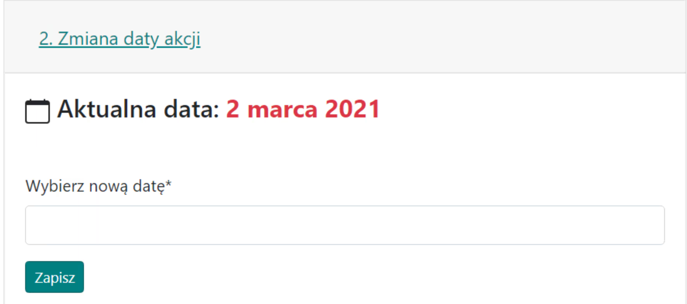

# 2. Zmiana daty akcji

Zakładka jest bardzo prosta i służy do zmiany daty wejścia akcji, która była wstępnie podana na początku przy tworzeniu rozpiski.

Wygląd zakładki z przykładową datą:

{ width="600" }

Nie istnieje i nie będzie istniała możliwość de facto rozpisania akcji na kilka dni. Jedyną możliwością jest rozpisanie akcji na pierwszy dzień np. 01.01, wysłania wyników graczom, a następnie w {==Zakładce Wyniki==}, po zakończonej rozpisce, możesz znaleźć pozostałe, niewykorzystane jednostki w zakładce {==Niewykorzystane wojska==}. Tworząc nową rozpiskę z inną datą, np. na kolejny dzień 02.01 i kopiując tam te dane o Wojskach, można rozpisać akcję na kolejny dzień.