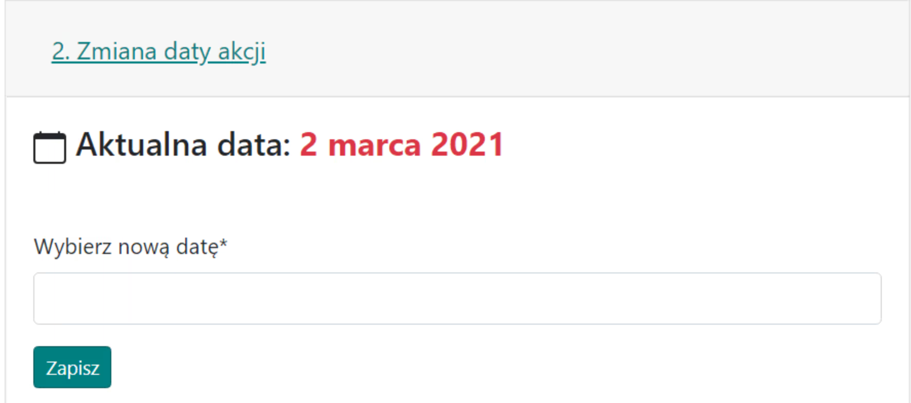

Zakładka służy do ustawiania daty akcji. Możesz wybrać ją podczas tworzenia rozpiski, a później nadal zmienisz ją z kolumny {==Data akcji==} w podsumowaniu u góry strony planera.

Wygląd zakładki z przykładową datą:

{ width="600" }

Jeśli wyniki zostały już wygenerowane, zapisz nową datę i użyj ponownie przycisku {==Zakończ Rozpiskę==}, aby wyniki zostały wygenerowane ponownie z nową datą.

{ width="600" }

Nadal nie ma możliwości rozpisania jednej akcji na kilka różnych dni. Dla akcji wielodniowych zakończ pierwszy dzień, wyślij wyniki, a potem użyj pozostałych niewykorzystanych wojsk z {==Zakładki Wyniki==}, aby przygotować nową rozpiskę na kolejny dzień.