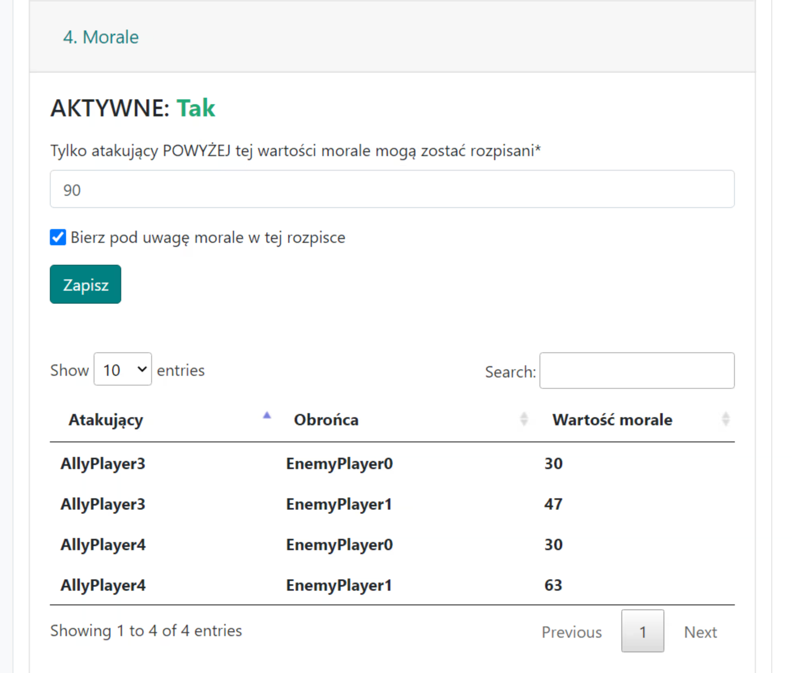

# 4. Morale

Zakładka służy do kontrolowania wartości morale morale przy rozpisywaniu akcji.

Ustawienia:

{ width="600" }

Uwaga. Domyślnie opcja jest wyłączona w każdej akcji, ale możesz zmienić to zachowanie przechodząc do Menu -> Moje konto.

Pierwsze pole Tylko atakujący POWYŻEJ tej wartości morale mogą zostać rozpisani służy do decydowania jaka najniższa dopuszczalna wartość morale jest w porządku dla akcji. Często będzie to wartość 90-100 w zależności od tego na jakim etapie jest świat, na jakie cele rozpisujemy akcje itd. Wpływ na wynik akcji wygląda tak, że dla danego celu (każdego z osobna!) listę wszystkich dopuszczalnych wiosek z których mogłyby być na niego rozpisane ataki, filtrujemy, pomniejszamy o te wszystkie, które nie spełniają naszych wymagań dotyczących morale.

Czyli w teorii mając wśród wielu celów kilka czy kilkanaście graczy z małą ilością punktów, na nich rozpisane zostaną ataki z graczy z plemienia również z mniejszą ilością punktów.

W skrajnych sytuacjach można odznaczyć drugą opcję Bierz pod uwagę morale w tej rozpisce co skutkuje nie braniem pod uwagę morali.

Uwaga w plemionach występują w kolejności popularności trzy ustawienia morale: oparte na punktach, oparte na punktach i czasie oraz brak morali:

1. Morale bazujące na punktach

    Dla najbardziej popularnej morale opierają się tylko na punktach gracza atakującego i obrońcy, co Planer implementuje dokładnie, choć nie brane są pod uwagę początkowe ochrony występujące na niektórych światach (choć rozpisywanie planerem akcji na wioski graczy, którzy są na świecie poniżej np. 2 tygodni wydaje się niezbyt prawdopodobne).

2. Morale bazujące na punktach i czasie

    W tym przypadku oprócz punktów, morale są zwiększane proporcjonalnie do czasu gry obrońcy na świecie, aż do maksymalnej wartości 50%. Gra nie udostępnia tego typu danych. Planer natomiast pobiera dane o wszystkich światach ze wszystkich serwerów gry od wielu lat, stąd też są brane dane dotyczące czasu gry graczy na świecie (z wewnętrznej bazy danych utrzymywanach w ramach strony). Wynik powinien być dokładny i zbieżny z grą.

3. Brak morale

    W tym przypadku zakładka jest nieaktywna zaś kwestia morali pomijana.