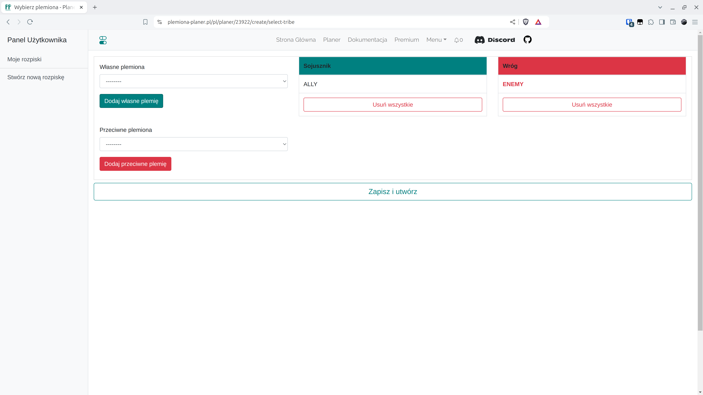

# Krok 1 - Tworzenie Rozpiski

Po ewentualnym utworzeniu konta lub zalogowaniu, należy utworzyć nową rozpiskę w zakładce {==Stwórz nową rozpiskę==} pamiętając by wybranym światem gry był Świat Test. W obecnej wersji datę można swobodnie zmieniać w późniejszym czasie.

<figure markdown="span">
  
  <figcaption>Wybierz Świat Test</figcaption>
</figure>

!!! info

    Po kliknięciu Potwierdź zostaniesz przeniesiony od razu do następnej zakładki.