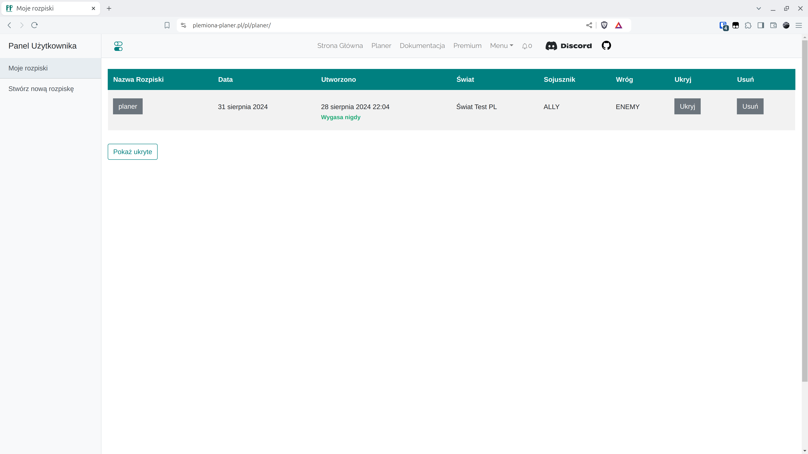

# Krok 3 - Uzupełnianie Zbiórki Wojska

Aby przejść do nowo utworzonej rozpiski, kliknij na jej nazwę.

<figure markdown="span">
  
  <figcaption>Kliknij na "rozpiska"</figcaption>
</figure>


Tutaj wklejamy wyniki generowane przez skrypty. Zbierają one informacje o każdym graczu w naszym plemieniu do jednego pola tekstowego, skąd je kopiujemy i wklejamy w odpowiednie pole w tej zakładce. Tutaj ten wynik jest przetwarzany by upewnić się, że wklejane informacji mają sens. Sprawdzane jest przede wszystkim to czy wszystkie wioski istnieją na wybranym świecie, czy mają właściciela, czy właściciel jest w jednym z plemion, które ustaliliśmy wcześniej. Dalej długość, ilość przecinków w każdym wierszu (chłopi, rycerze, łucznicy wpływają na długość wierszy - jeśli są to jest więcej cyfer itd.) i czy nie ma pustych miejsc w środku. Warto jednak wiedzieć, że coś innego niż rezultat skryptu nie przejdzie.

!!! warning

    Aby przejść do kolejnych zakładek konieczne jest wklejenie danych w tej zakładce, nie podając ich, nie masz możliwości pójścia dalej!


Dla celów Świata Testowego wklej w pole Zbiórka Wojska poniższe dane.

=== "Zbiórka Wojska"

    ```title="army.txt"
    --8<-- "army.txt"
    ```

=== "Zbiórka Obrona"

    ```title="defence.txt"
    --8<-- "defence.txt"
    ```

Następnie zapisz.

<figure markdown="span">
  
  <figcaption>Wklej i potwierdź</figcaption>
</figure>
