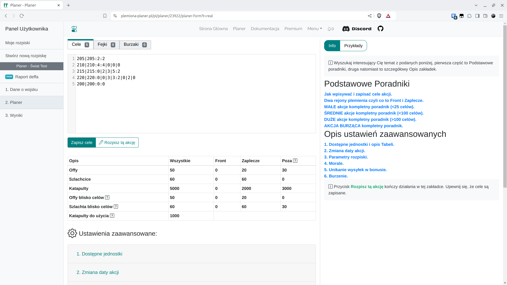

# Krok 4 - Zapisze cele oraz ustawienia i rozpisz

W zakładce Planer należy podać cele akcji. Klikając {==Zapisz cele==} aktualizujemy cele na które planujemy rozpisać akcję. Klikając na {==Rozpisz tą akcję==} kończymy tą część rozpisywania i przechodzimy do następnych zakładek. Przed przystąpieniem do rozpisywania własnych akcji, należy przeczytać opisy interesującego nas typu akcji i najlepiej poeksperymentować w ustawianie różnych odległości od frontu, maksymalnych odległości dla szlachciców, zmieniać tryby rozpiski, następnie klikać Rozpisz tą akcję i w razie niesatysfakcjonujących rezultatów, powracać klikając **Powrót**.

Na świecie testowym wklej poniższe cele i kliknij zapisz:

=== "Cele akcji"

    ```title="targets.txt"
    --8<-- "targets.txt"
    ```

!!! info

    Cele mogą być wklejane na kilka sposobów, najłatwiej w kolejnych linijkach wklejać kolejne same kordy, wówczas domyślnie ilość offów i szlachty zostanie uzupełniona jako 0. Ilość offów i szlachty kodowane są najprościej jako np. `koordy:2:2` co oznacza `koordy:dwa-offy:dwa-szachcice`, a bardziej dokładnie zapis `kordy:2:1|1|1|1` oznaczać będzie 2 offy i po 1 szlachcicu kolejno z bliska, bliskiego zaplecza, losowo, z daleka. Fejki i Burzaki wpisujemy w odpowiednich zakładach w ten sam sposób.

Cała zakładka służy głównie dwóm celom, jest to wpisywanie celów, oraz automatyczne ustawienia dotyczące rozpisywania akcji. Dla celów zapoznawczych Świata Testowego, uzupełnimy jedynie tabelę z wioskami frontowymi i zapleczowymi, widoczną pod przyciskami do zapisywania celów i rozpisywania akcji. Jeśli ciekawią Cię pozostałe zakładki, możesz dowiedzieć się o nich więcej z innych części dokumentacji.

<figure markdown="span">
  
  <figcaption>Zapisane cele</figcaption>
</figure>

Rozwiń pierwszą zakładkę {==1. Dostępne jednostki==}. W polach formularza pozostaw domyślne wartości. Celem jest podzielenie wszystkich naszych wiosek na trzy grupy, Frontowe, Zapleczowe oraz Poza (bardzo dalekie) w zależności od wpisanych wrogich plemion (liczona jest odległość od najbliższych wrogów dla każdej naszej wioski). Zatwierdź formularz klikając Zapisz i odśwież dostępne.

Powinieneś zobaczyć w tabeli poniższe rezultaty:

<figure markdown="span">
  
  <figcaption>Przeliczone offy i szlachta blisko celów</figcaption>
</figure>

Kliknij teraz {==Rozpisz tą akcję==}, czas na kolejną zakładkę :)

!!! info

    Dla różnych akcji, ich rozypisywanie będzie się nieco różnić. Dla mniejszych akcji np. w początkowym etapie światów, warto dopracowywać każdy cel z osobna w wygodnej edycji, ale dla ogromnych akcji to oczywiście niemożliwe, wtedy należy bardziej skupić się na zakładce Planer i dostepnych tam ustawieniach.

 