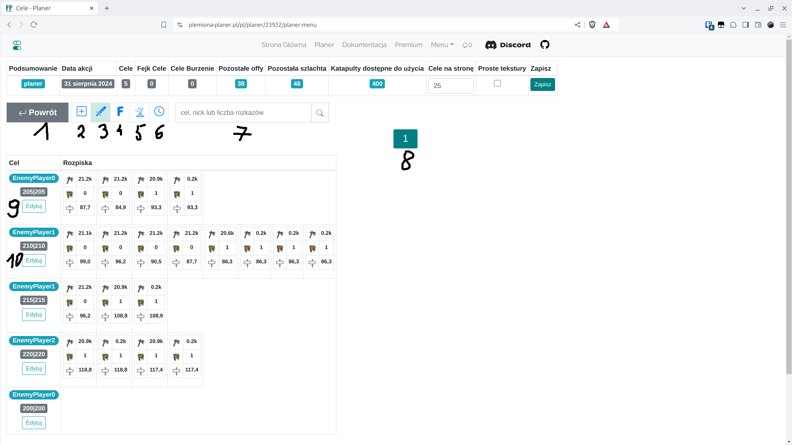
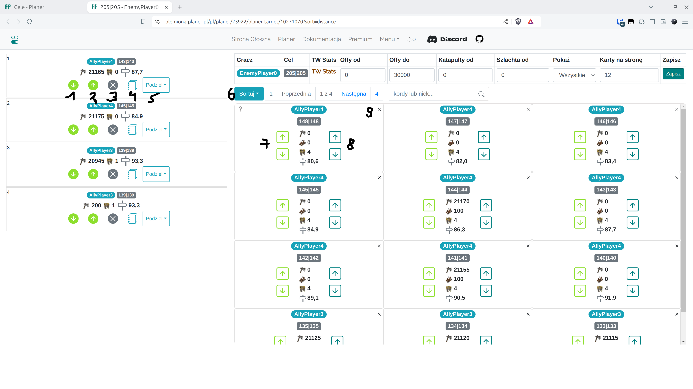

# Krok 5 - Edycja rozpiski

Następny widok to rozpisana akcja bazująca na ustawieniach z poprzedniej zakładki. Istnieje opcja manualnej edycji poszczególnych celów, dodawania celów, wyszukiwania.

<figure markdown="span">
  
  <figcaption>Zakładka menu</figcaption>
</figure>

| Numer | Opis                                                                                     |
| ----- | ---------------------------------------------------------------------------------------- |
| 1     | Powrót do poprzedniej zakładki, reset rozpiski                                           |
| 2     | Dodanie nowych celów manualnie                                                           |
| 3     | Podgląd prawdziwych celów (obecna zakładka)                                              |
| 4     | Podgląd fejk celów                                                                       |
| 5     | Podgląd celów do burzenia                                                                |
| 6     | Zakładka do ustawiania czasów, omawiana w [następnym kroku](./step_6_set_time_finish.md) |
| 7     | Wyszukiwarka                                                                             |
| 8     | Nawigacja pomiędzy stronami                                                              |
| 9,10  | Edycja pojedynczego celu ataku                                                           |

Kliknij na "Edytuj" pierwszego celu (numer 9). Widok edycji pojedynczego celu otworzy się **w nowej karcie przeglądarki**.

<figure markdown="span">
  
  <figcaption>Edycja pojedynczego celu</figcaption>
</figure>

| Numer | Opis                                                                                                                     |
| ----- | ------------------------------------------------------------------------------------------------------------------------ |
| 1     | Przesuń rozkaz na dół                                                                                                    |
| 2     | Przesuń rozkaz do góry                                                                                                   |
| 3     | Usuń rozkaz (jednostki wrócą automatycznie do wolnej puli po prawej stronie ekranu)                                      |
| 4     | Edycja ilości jednostek w tym rozkazie                                                                                   |
| 5     | Podziel na wiele rozkazów                                                                                                |
| 6     | Sortowanie wolnych, dostępnych jeszcze jednostek                                                                         |
| 7     | Dodawanie offów na początek lub koniec                                                                                   |
| 8     | Dodawanie offów wraz z szlachtą na początek lub koniec                                                                   |
| 9     | Ukryj wioskę. Można również ukryć ją używając filtrowania na górze ekranu. Aby następnie ją widzieć, zmień opcję "Pokaż" |

Po dokonaniu dowolnych zmian, {==zamknij kartę przeglądarki==}.