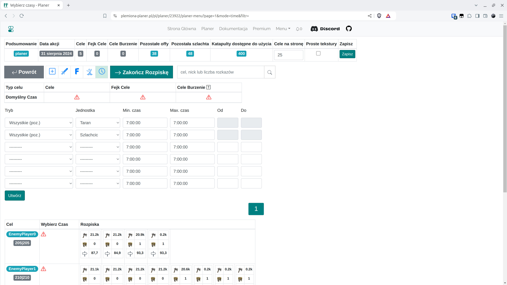
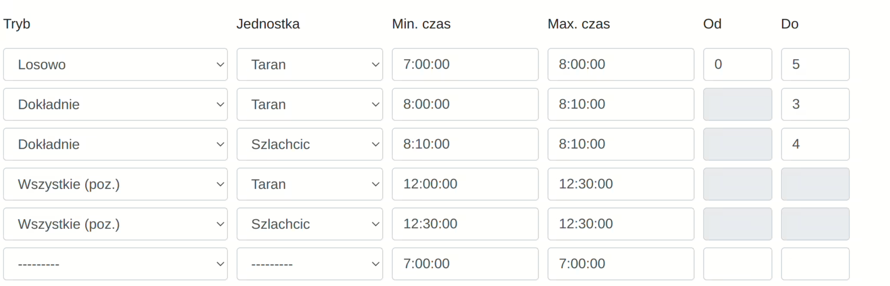
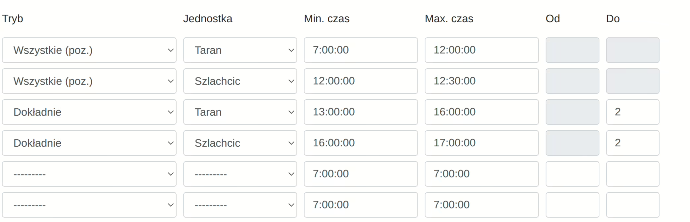

# Krok 6 - Ustawienia czasów wejścia i zakończenie rozpiski

!!! info

    Po oglądnieciu wszystkich zakładek i ewentualnych operacjach w edycji poszczególnych celów, na koniec, w celu zakończenia rozpiski skieruj się do ostatniej zakładki z czasami.

<figure markdown="span">
  
  <figcaption>Zakładka czasów, możesz użyć powyższego bardzo prostego czasu i kliknąć "Utwórz"</figcaption>
</figure>

Użytkownik ma możliwość tworzenia wielu obiektów w zakładce, w praktyce jednak wystarczyć może nawet jeden lub kilka. Wybieramy przedziały czasowe dla rozkazu, jednostkę oraz tryb spośród 3 możliwych. Przykładowy, skomplikowany czas mógłby wyglądać tak:

<figure markdown="span">
  
  <figcaption>Przykład 1.</figcaption>
</figure>

Co oznacza:

- Rozpisać losową liczbę offów pomiędzy 0 a 5 między 7:00 a 8:00 (lub mniej jeśli zostały wykorzystane)

- Rozpisać dokładnie 3 offy pomiędzy 8:00 a 8:10 (lub mniej jeśli zostały wykorzystane)

- Rozpisać dokładnie 4 szlachcie na 8:10 (lub mniej etc j.w.)

- Rozpisać wszystkie pozostałe tarany o ile jeszcze są między 12:00 a 12:30

- Rozpisać wszystkie pozostałe szlachcice na 12:30

Wspierana jest także możliwość, aby {==Wszystkie pozostałe==} były również wcześniej niż pozostałe tryby. W poniższym przykładzie cel dostanie zawsze 2 offy i 2 szlachciców pod koniec dnia, i całą resztę (ilość można ustawić różną dla różnych wiosek) na rano. Podane czasy muszą mieć sens, godzina maksymalnego wejścia musi być późniejsza lub taka sama co minimalnego wejścia. Tryb Wszystkie (poz.) musi pojawić się dokładnie dwukrotnie: dla jednostki Taran i Szlachcic, ma on najniższy priorytet.

<figure markdown="span">
  
  <figcaption>Przykład 2.</figcaption>
</figure>

Dla celów świata testowego, możesz utworzyć prosty czas z pierwszego zdjęcia i ustawić go dla wszystkich celów u góry zakładki. Następnie zakończ rozpiskę klikając na {==Zakończ rozpiskę==}.

Automatycznie przjedziesz do kolejnej zakładki z wynikami rozpiski.

