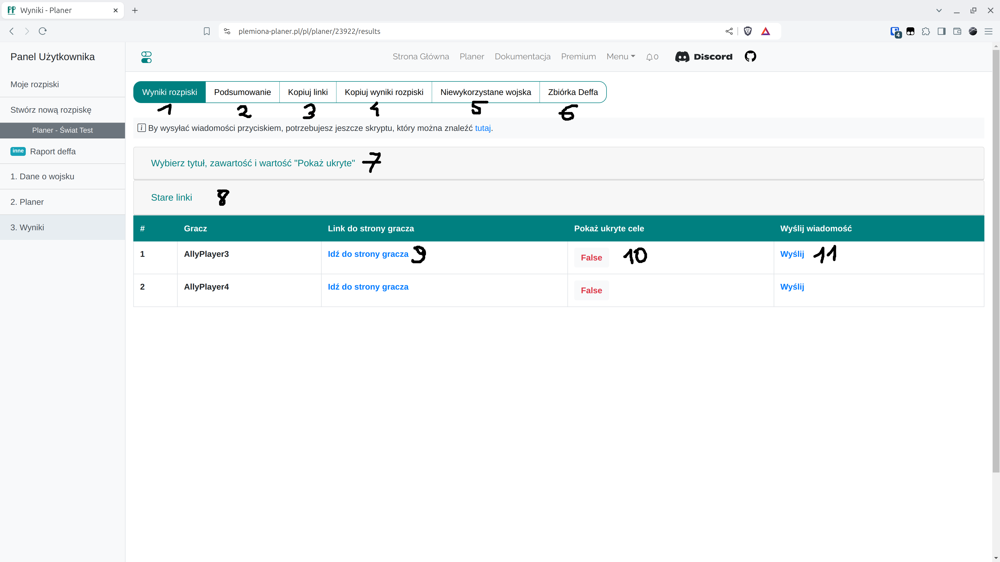

# Krok 7 - Zakładka wyników

<figure markdown="span">
  
  <figcaption>Zakładka wyników.</figcaption>
</figure>

| Numer | Opis                                                                                                                 |
| ----- | -------------------------------------------------------------------------------------------------------------------- |
| 1     | Tabela z linkami do celów graczy i linki do wysyłki oraz formularz do zmiany treści wysyłanych wiadomości            |
| 2     | Krótkie tekstowe podsumowanie nicków i celów                                                                         |
| 3     | Pole tekstowe z linkami, które można przesłać graczom ręcznie                                                        |
| 4     | Wyniki rozpiski jako cały tekst do przesłania (wszyscy gracze)                                                       |
| 5     | Niewykorzystane wojska do kolejnej akcji (PREMIUM)                                                                   |
| 6     | Wyniki zbiórki deffa z zakładki ZBIÓRKA DEFFA                                                                        |
| 7     | Formularz do treści wysyłanej wiadomości oraz ukrywania rozkazów innych graczy                                       |
| 8     | Tabela z starymi linkami dostępnymi dla tej rozpiski                                                                 |
| 9     | Tym linkiem przechodzimy do unikalnej strony z celami gracza                                                         |
| 10    | Ręczna możliwość zmiany ukrywania rozkazów innych graczy                                                             |
| 11    | Link do wysłania wiadomości w grze, wymagany [Skrypt Auto uzupełnianie wiadomości](./../scripts/sending_messages.md) |

!!! info

    Utworzony został {==UNIKALNY ADRES URL==} dla każdego gracza gdzie prezentowane są tylko i wyłącznie jego cele wraz z tekstem do wklejenia w notatkach, oraz graficznym zaprezentowaniem jego rozkazów. Możesz przejść do nich klikając na przyciski 9 na powyższym zdjęciu. Gracz po wejściu w swój link, ma już wszystko czego mu trzeba by wysłać przewidziane przez rozpiskę wojska na akcję.

Rozwijając zakładkę {==Wybierz tytuł, zawartość i "Pokaż ukryte"==} czyli numer 7, precyzujesz treść wysyłanej graczom wiadomości oraz czy gracze powinni widzieć rozkazy innych graczy w szczegółach swoich indywidualnych celów. Domyślnie Pokaż ukryte - False ozancza, że widzą tylko swoje rozkazy i rozkazy innych tylko jeśli atakują tą wioskę szlachtą z bliska. Ustawiając Pokaż ukryte - True gracze widzą wszystkie rozkazy innych. Pod numerem 8 znajdziesz tabelę ze wszystkimi utworzonymi linkami, po każdym zatwierdzeniu rozpiski, tworzą się nowe zaś stare trafiają do tej zakładki (ale są nadal aktywne!).

Uwaga! Z biegiem czasu i rozwojem aplikacji, zmieniono (i już tak pozostanie) usuwalne linki na nieusuwalne linki, których użytkownik nie ma możliwości zmiany ani zablokowania dostępu np. po wysłaniu nieodpowiedniej osobie. Konwencja ta gwarantuje, że rozpisujący nie usunie przypadkowo rozesłanych już linków, co spowodowałoby ogromne nieporozumienia. Linki są aktywne przez 30 dni, niezależnie czy rozpiska nadal istnieje, czy też została usunięta.