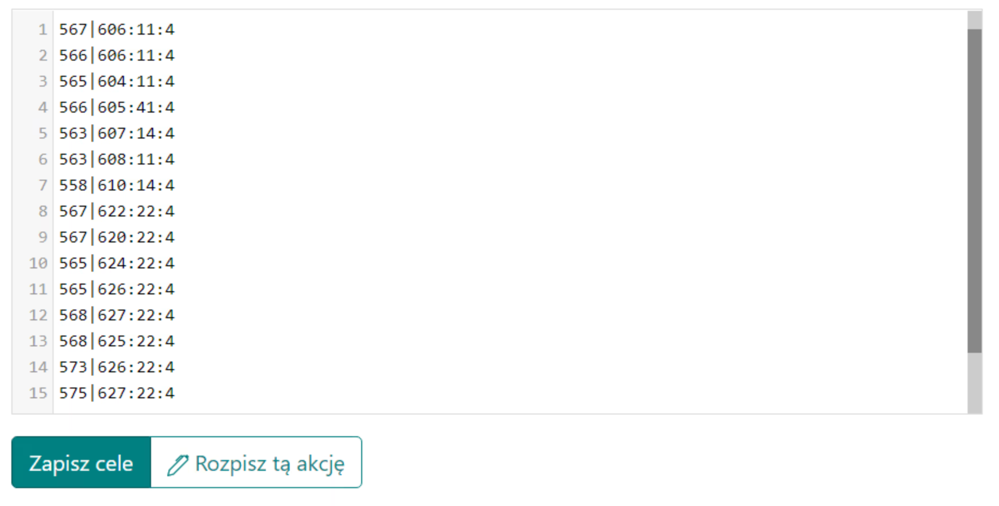

# Duże akcje - poradnik

Uwaga, podany niżej pomysł na duże akcje nie jest zobowiązujący, można to robić w dowolny sposób.

W tym poradniku zobaczysz jak najefektywniej i najskuteczniej rozpisywać dużą akcję, docelowo w późnym etapie świata, na więcej/dużo więcej niż 100 celów, gdzie w plemieniu są już podczas akcji brane pod uwagę same pełne offy. Uwaga, zakładana jest już cała wiedza z [Pierwszych kroków z planerem](./../first_steps/index.md)! oraz zalecane przeczytanie najpierw dwóch krótkich poprzednich poradników w tym dziale, czyli [Jak wpisywać i zapisać cele akcji](./two_regions_of_the_tribe.md) i [Dwa rejony plemienia czyli co to front i zaplecze](./two_regions_of_the_tribe.md).

!!! hint

    Zawsze rozpoczynaj rozpisywanie dowolnej akcji na tej stronie od policzenia wszystkich offów i podzieleniu ich na Frontowe i Zapleczowe zgodnie z duchem danej rozpiski. Do tego celu służy zakładka 1. Dostępne jednostki, zaś wyniki prezentowane są w tabeli pod celami.

Akcję będziemy rozpisywać wykorzystując automatyczne rozpisywanie z racji ilości celów i skorzystamy z wszelkich dostępnych zaawansowanych opcji. Nie będziemy korzystać z ręcznych możliwości edycji celów, całość akcji A-Z będziemy tworzyć w pierwszej zakładce, następnie tylko ustalać czasy wejścia i rozsyłać gotowe cele.

Dla dużej akcji uzupełniona zakładka może wyglądać następująco:

{ width="600" }

Ustaw tam minimalną liczbę w offie na pełnego offa, ok. 19k lub ciut mniej jeśli przewidywane wysyłki są dopiero za kilka dni i offy zdążą się dorobić pełne przez ten czas (tylko offy powyżej tego będą pokazane w tabeli), odległość od lini frontu na około 10-45 w zależności od tego jak wygląda front. Jeśli przeciwnik ma na terenie plemienia diody, wyrzuć je wklejąc w pole Nieuwzględniane przy liczeniu frontowych offów wioski wroga. Klikamy Zapisz i odśwież dostępne. Uzupełniona zostanie tabela z ilością naszych offów.

Tak mniej więcej powinna wyglądać uzupełniona tabela:

{ width="600" }

Uwaga, dwa dolne wiersze tabeli pojawią się dopiero po tym jak uzupełnimy cele, ponieważ ilości tam wpisane zależą od tego, jakie cele są zapisane (to wokół nich liczone są te offy i szlachta). Stąd na początku będą tam zera. Możesz przejść do wpisywania celów w zależności od ilości offów i szlachty, którymi dysponujesz. Następnie możesz ponownie policzyć Dostępne jednostki.

Przykład wpisywanych celów:

{ width="600" }

Jeśli któreś cele mają mieć inne ustawienia od domyślnych, korzystaj z rozszerzonego kodowania offów i szlachty opisanego w artykule Jak wpisywać i zapisać cele akcji. Następnie przejdź do zakładki 3. Parametry rozpiski by ustalić ustawienia dla tej rozpiski, dokładny opis wszystkich opcji w razie trudności, znajdziesz w temacie jej poświęconym, czyli 3. Parametry rozpiski.

Przykład ustawień dla akcji dużej:

{ width="600" }

Dodatkowo możesz w [zakładce 4. ustawić morale](./../advanced/4_morale.md).

Ostatnie co powinieneś przemyśleć, jest zakładka [5. czyli unikanie wysyłek w bonus nocny](./../advanced/5_avoid_night_bonus.md), prawdopodobnie będzie to korzystne, przynajmniej dla graczy i ich zdrowia, z racji mniejszej ilości lub zlikwidowania wysyłek w środku nocy :)

Po wpisaniu wszystkich celów, zmianie ustawień akcji i ewentualnie bonusu nocnego, znanym już z Świata Testowego sposobem przejdź do dalszej części rozpiski klikając Rozpisz tą akcję, następnie sprawdź czy wszystko jest OK i ewentualnie powróć przyciskiem Powrót, zmień ustawienia. Potem standardowo przejdź do zakładki Czasów, ustal czasy wejścia, zakończ rozpiskę i roześlij graczom ich cele.