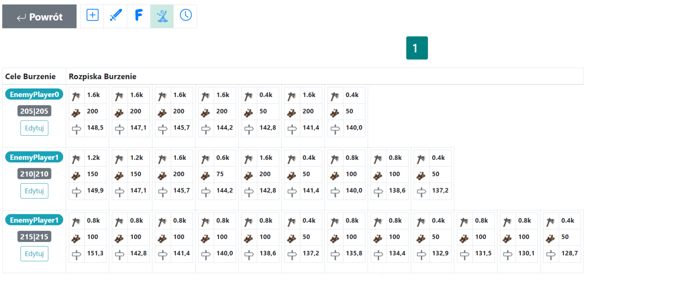

W tym poradniku zobaczysz, jak rozpisywać akcje burzące, szczególnie na późniejsze etapy świata. Uwaga: zakładana jest już pełna wiedza z [Pierwszych kroków z planem](./../first_steps/index.md)! Dodatkowo zaleca się najpierw przeczytać dwa krótkie poprzednie poradniki w tej sekcji, czyli [Jak wpisywać i zapisywać cele akcji](./two_regions_of_the_tribe.md) i [Dwa rejony plemienia, czyli co to front i zaplecze](./two_regions_of_the_tribe.md).

!!! hint

    Zawsze zaczynaj rozpisywanie dowolnej akcji na tej stronie od policzenia wszystkich jednostek i podzielenia ich na jednostki Frontu i Zaplecza zgodnie z charakterem danego planu. W tym celu użyj zakładki 1. Dostępne jednostki, a wyniki są prezentowane w tabeli pod celami.

Akcja jest tworzona w polu **Burzaki** obok celów. Ustawienia w zakładce {==6. Burzaki==} określają kolejność burzonych budynków oraz minimalną liczbę katapultów wymaganych do kwalifikacji wioski do ataków burzących. Dokładny przebieg burzenia pochodzi z wbudowanych tabel ruin, więc planner sprawdza poziom po każdym ataku i wysyła tylko tyle katapultów, ile potrzeba do kolejnego dokładnego kroku.

Przykład celów burzących i wyników tabeli, po 3 offach i *50 burzakach:

{ width="600" }

Przykład ustawień akcji burzącej, celującej w 3 widoczne budynki w tej kolejności:

{ width="600" }

Szacunkową liczbę dostępnych burzaków możesz uzyskać, korzystając z zakładki {==1. Dostępne jednostki==} i prostej matematyki. Po każdym odświeżeniu w tabeli pod nazwą **Liczba wszystkich dostępnych katapult** znajdziesz całkowitą liczbę katapult gotowych do rozpisania. Wystarczy zdecydować, na ile celów wystarczą.

Przykład rozpisanej mini-akcji z różną liczbą katapultów od 200 do 50:

{ width="600" }

## Dokładny dobór katapultów do burzenia

Wioski z większą liczbą dostępnych katapultów mają (lokalnie) priorytet. Planer zawsze korzysta z dokładnej tabeli burzenia dla wybranego typu wioski oraz poziomu budynku. Ta sama logika jest używana zarówno w przebiegu offów w celach do burzenia, jak i w atakach burzących, więc po każdym uderzeniu sprawdzany jest dokładny pozostały poziom budynku i algorytm kontynuuje, aż budynek zostanie zniszczony. Potem kolejny itd.

## Offy przed burzakami

Offy zaplanowane przed atakami burzącymi wykorzystują ten sam harmonogram niszczenia budynków co późniejsze ataki burzące, ale są rozpisywane PRZED burzakami. Ich rozkazy pozostają standardowymi OFFami. Uwaga: w przypadku zburzenia wszystkich budynków (np. `000|000:100:0` czyli 100 offów burzących na cel a tylko 1 budynek do zburzenia) nie wszystkie offy zostaną rozpisane!

## Kolejność burzenia budynków

W ustawieniach {==6. Burzenie==} można zmienić kolejność burzonych budynków. Ważne jest, aby pamiętać, że budynki nieobecne na tej liście są pomijane, a algorytm zatrzymuje się w dwóch przypadkach: albo brakuje katapult do rozpisania, albo wszystkie wymienione budynki zostały już zburzone. To oznacza, że nawet jeśli zdecydujemy się wpisać `000|000:0:1000`, to prawdopodobnie nie zostanie rozpisanych 1000 burzaków — po zburzeniu wymienionych budynków Planer przechodzi do kolejnych etapów (np. do kolejnego celu itd.).

## Mam pokazane 10000 dostępnych katapult. Ile to celów?

Odpowiedź brzmi: zależy. Głównie od wybranej kolejności budynków. Załóżmy, że wybrano tylko jeden budynek, **[ Kuźnia ]**. W takim przypadku 200-250 katapult (np. 200 i 50, albo 100, 100, albo 50, 50, 50, 50 itd.) wystarcza do zburzenia jednej wioski, więc można rozplanować 40-50 celów. Jeśli wybrane są dwa budynki, **[ Kuźnia, Zagroda ]**, to na kuźnię potrzeba 200-250 katapult, a na Zagrodę 500-700 katapult (np. 14x 50, albo 5x 100, 4x 150, 3x 200 katapult lub wiele innych kombinacji), co daje 700-950 katapultów na wioskę, czyli 10-14 celów. Poniżej znajduje się prosta tabela dla budynków 30 poziomowych (np. Zagrody, Spichlerze, wszystkie budynki ekonomiczne) oraz 20 poziomowych (Ratusz, Kuźnia), która pomoże policzyć, ile celów jest możliwych.

|                      | Ilość katapultów wymagana do pełnego zburzenia budynku |
| -------------------- | ------------------------------------------------------ |
| Budynki 20 poziomowe | 200-250                                                |
| Budynki 30 poziomowe | 500-700                                                |

## Rozmiar wioski i tabela burzenia

Dokładna tabela burzenia jest wybierana na podstawie punktów wioski (celu). Obecnie (co może ulec dalszej poprawie), wioski powyżej 8 000 punktów używają poziomów burzenia dla dużych wiosek, natomiast wioski mniejsze dla średnich wiosek.

## Podsumowanie

Pamiętaj, że fundament rozpisywania nadal stanowi prosty algorytm zachłanny, a planner **ZAWSZE** przydziela burzaki, fejk, albo offy w bardzo podobny sposób. Jeśli chcesz, aby offy albo burzaki były nierozróżnialne od fejków, musisz rozplanować dużo fejków. Przy planowaniu burzenia warto włączyć opcję **Fejki ze wszystkich wiosek** w {==Zakładce 3. Domyślne ustawienia akcji==}, która, w przeciwieństwie do domyślnego ustawienia, przydziela fejk z wszystkich tylnych wiosek.

Zastanów się nad liczbą katapultów oraz budynków, które naprawdę warto zburzyć, i rozpisz mnóstwo fejków. Miłego gruzowania!
