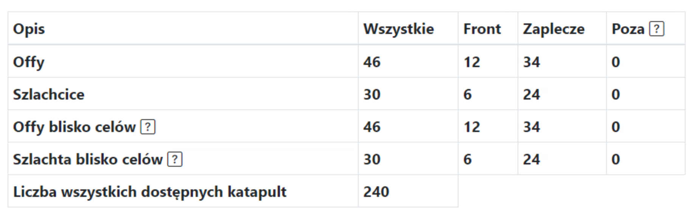

# Małe akcje - poradnik

Uwaga, podany niżej pomysł na małe akcje nie jest zobowiązujący, można to robić w dowolny sposób, choćby potraktować je jako średnie akcje.

W tym poradniku zobaczysz jak najefektywniej i najskuteczniej rozpisywać małą akcję, docelowo w początkowym etapie świata, na mniej niż 25 celów (w praktyce limit nie istnieje, ale zaprezentowana metoda będzie coraz bardziej czasochłonna wraz ze wzrostem liczby celów). Uwaga, zakładana jest już cała wiedza z [Pierwszych kroków z planerem](./../first_steps/index.md)!

!!! hint

    Zawsze rozpoczynaj rozpisywanie dowolnej akcji na tej stronie od policzenia wszystkich offów i podzieleniu ich na Frontowe i Zapleczowe zgodnie z duchem danej rozpiski. Do tego celu służy zakładka 1. Dostępne jednostki, zaś wyniki prezentowane są w tabeli pod celami.

Pomysł polega na ręcznym rozpisaniu rozkazów na wszystkie cele i nie korzystaniu z możliwości automatycznego rozpisywania. Jest ku temu kilka powodów, gdy gracze nie mają pełnych offów, mnóstwa grubych i odległości do wrogów nie są sensowne (przemieszanie z wrogiem nie jest sensowne), automatyczne rozpisywanie akcji mija się z celem. Dokładnie i szybko można zrobić to ręcznie - tylko że ręcznie z pomocą Planera!, co przyspiesza tworzenie rozpiski i rozsyłanie celów do maksimum. Do tego był wstępnie stworzony, właśnie do małych akcji, w tym jest najlepszy. Cała nakładka do większych akcji to późniejsze dodatki.

Dla małej akcji uzupełniona zakładka może wyglądać następująco:

{ width="600" }

Ustaw tam minimalną liczbę w offie na adekwatną, **małą wartość np. 2000**, (tylko offy powyżej tego będą pokazane w tabeli), odległość od lini frontu również małą czyli **1-10 kratek**. Klikamy Zapisz i odśwież dostępne. Uzupełniona zostanie tabela z ilością naszych offów.
Tak mniej więcej powinna wyglądać uzupełniona tabela:

{ width="600" }

Uwaga, dwa dolne wiersze tabeli pojawią się dopiero po tym jak uzupełnimy cele, ponieważ ilości tam wpisane zależą od tego, jakie cele są zapisane (to wokół nich liczone są te offy i szlachta). Stąd na początku będą tam zera. Możesz przejść do wpisywania celów w zależności od ilości offów i szlachty, którymi dysponujesz. Następnie możesz ponownie policzyć Dostępne jednostki.

{ width="600" }

Po wpisaniu kordów jak wyżej i ich zapisaniu, każda linijka będzie wyglądać podobnie do 000|000:0:0.
Ignorujemy wszystkie pozostałe zaawansowane ustawienia, pozostawiając 0 offów i 0 szlachty w każdej linijce i klikamy Rozpisz tą akcję.

Po przejściu do następnej zakładki, zauważymy, że wszystkie cele są puste. Przechodzimy kolejno do edytowania wszystkich celów przyciskami Edytuj i rozpisujemy rozkazy od najbliższych graczy w wybranej przez siebie kolejności, pomocne będą sortowania oprócz domyślnego Rosnąco ze względu na odległość, Najbliższe pełne offy oraz Najbliższa szlachta.

Powyżej pokazano jak może wyglądać przykładowo rozpisany cel w początkowym etapie gry, 2 offy na początku, następnie 4 szlachcice. Pamiętaj że po każdym dodaniu wojsk, aktualizuje się ich stan we wszystkich celach (innymi słowy, jest to dobrze zaprogramowane, nie rozpiszesz więcej wojsk niż maksimum posiadane przez graczy). Po rozpisaniu wszystkich celów, znanym już z Świata Testowego sposobem przejdź do zakładki Czasów, ustal czasy wejścia, zakończ rozpiskę i roześlij graczom ich cele.