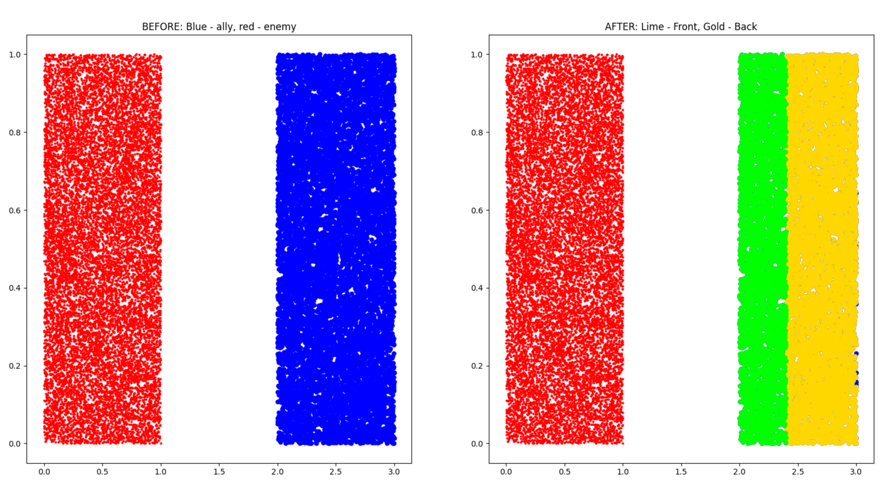
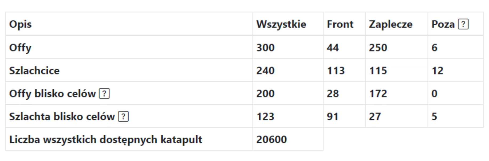
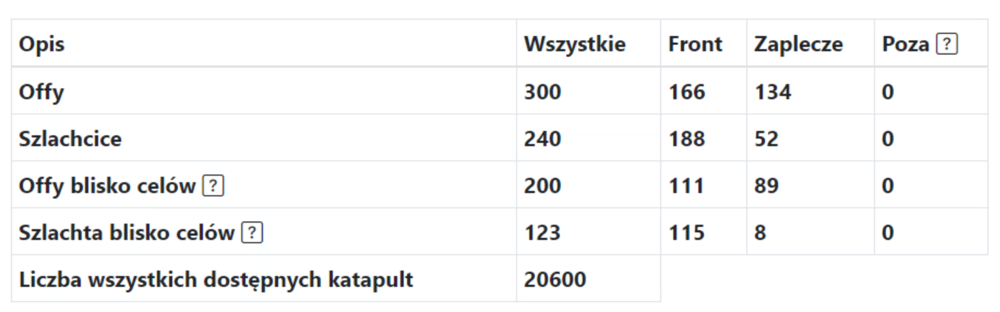

# Dwa rejony plemienia czyli co to Front i Zaplecze

!!! hint

    Zawsze rozpoczynaj rozpisywanie dowolnej akcji na tej stronie od policzenia wszystkich offów i podzieleniu ich na Frontowe, Zapleczowe oraz Poza zgodnie z duchem danej rozpiski. Do tego celu służy zakładka 1. Dostępne jednostki, zaś wyniki prezentowane są w tabeli pod celami.

## Intuicja

Odpowiedzią na to, by podczas rozpisywania akcji nie rozpisywać frontowych offów frontowcom, którzy powinni je trzymać na dobitki z bliska (lub używać w dowolny inny sposób), jest podział naszych wiosek na dwie najważniejsze grupy, Front, czyli offy i szlachta blisko wroga, oraz Zaplecze czyli offy i szlachta daleko od wroga. Od wersji 2.1.0 doszedł kolejny rejon Poza intuicyjnie oznaczający bardzo dalekie wioski (ale przykładów zastosowań jest więcej), rozwiązujący problem offów z bardzo daleka, które nie są porządane, ale nie tylko, bo również pozwalający na akcję offami z przedziału np. 20 kratek - 80 kratek. Jak dokładnie to się odbywa i jak to kontrolować, wyjaśni się za chwilę.

Całość intuicji związanej z podziałem można skrócić do poniższych zdjęć:

<figure markdown="span">
  
  <figcaption>Przykład 1. Podział na front i zaplecze, na zielono front zaś na żółto zaplecze</figcaption>
</figure>

<figure markdown="span">
  
  <figcaption>Przykład 2. Podział na front i zaplecze, na czerwono wróg a wokół niego nasze plemię, na zielono front zaś na żółto zaplecze</figcaption>
</figure>

Nasze plemiona (na niebiesko) otaczają wroga (czerwonego), na lewym zdjęciu widać stan SPRZED działania algorytmu, zaś na prawym PO jego zastosowaniu. Podzieliśmy całość naszych wiosek na "sektory" w zależności od odległości od wroga: najbliżej czerwonego- Front, trochę dalej ale nie do przesady- Zaplecze, zaś wioski bardzo dalekie pozostały niebieskie i oznaczają one Poza.

To, jak zostaną podzielone nasze offy i szlachta, zależy od ustawień w zakładce 1. Dostępne jednostki, rozważmy kilka popularnych możliwości.

!!! info

    Offy blisko celów i szlachta blisko celów, działają identycznie jak Offy i Szlachta, tyle tylko, że zamiast brać pod uwagę "wszystkich" wrogów i na tej podstawie dzielić na rejony, biorą pod uwagę tylko cele wpisane przez Użytkownika w Cele. Jest to dużo dokładniejszy wynik, bo wiadomo ile mamy dostępnych jednostek w pobliżu celów (może się to bardzo różnić w stosunku do tego co mamy w całym plemieniu).

## Przykład 1

Przykład wyniku dla min. 0 kratek i maks. 500 kratek- czyli nie chcemy ŻADNYCH "Frontów" i żadnych "Poza", wszystko jest zapleczem i wszystko można rozpisać.

<figure markdown="span">
  { width="600" }
  <figcaption>0 kratek front i maks. 500 kratek zaplecze</figcaption>
</figure>

<figure markdown="span">
  { width="600" }
  <figcaption>0 kratek front i maks. 500 kratek zaplecze</figcaption>
</figure>

## Przykład 2

Przykład wyniku dla min. 15 kratek i maks. 100 kratek- czyli chcemy by gracze którzy mają poniżej 15 kratek od wroga, trzymali offy jako frontowcy i nie chcemy by jakikolwiek off miał dalej od celu niż 100 kratek (czyli leciał dłużej niż 2 doby etc).

<figure markdown="span">
  { width="600" }
  <figcaption>15 kratek front i maks. 100 kratek zaplecze</figcaption>
</figure>

<figure markdown="span">
  { width="600" }
  <figcaption>15 kratek front i maks. 100 kratek zaplecze</figcaption>
</figure>

## Przykład 3

Przykład wyniku dla min. 60 kratek i maks. 120 kratek- kiedy chcemy, aby zaplecze było powyżej 60 kratek od wroga i poniżej 120, np. przy akcji czy burzeniu z daleka (a z bliska robimy osobną).

<figure markdown="span">
  { width="600" }
  <figcaption>60 kratek front i maks. 120 kratek zaplecze</figcaption>
</figure>

<figure markdown="span">
  { width="600" }
  <figcaption>60 kratek front i maks. 120 kratek zaplecze</figcaption>
</figure>

Tylko offy większe niż wybrana minimalna liczba jednostek w offie zostaną pokazane. W obecnej wersji ck z offów również będą rozpoznane i odróżnione od ck z wiosek deffowych oraz policzone. Wynik zależy głównie od Przeciwnych plemion, które zostały wybrane na samym początku przy tworzeniu rozpiski. Algorytm jest bardzo prosty, dookoła każdej wrogiej wioski liczony jest rejon w odległości, która została podana jako odległość od linii frontu. Biorąc sumę tych wszystkich rejonów w całość, możemy dla każdej sojuszniczej wioski wskazać czy jest ona w pobliżu tych wrogich wiosek (wtedy jest frontowa), czy też nie jest (wtedy jest na zapleczu). Stąd też w pole Nieuwzględniane przy liczeniu frontowych offów wioski wroga wklejamy wszelkie wrogie diody, by nie zaburzały wyniku.

Dwa dolne wiersze uwzględniają jeszcze podaną maksymalną odległość dla szlachty, gdzie z mniejszej niż wskazana ilość kratek, nie zostanie rozpisany żaden szlachcic. Dodatkowo liczą one ilość offów i szlachty WOKÓŁ wpisanych celów, zatem nie wpisując jeszcze celów, dostaniemy tam liczby 0.

!!! hint

    Warto zawsze wybrać wszystkie nasze pobliskie wrogie plemiona do rozpiski, a nie tylko to na które rozpisujemy akcję. Jeśli nasze plemię ma dwa fronty z plemionami A oraz B, a my chcemy rozpisać akcję na A, to wciąż chcemy zachować frontowe offy przy B na użytek tamtejszych frontowców, stąd dodajemy oba plemiona do wrogich plemion (w przeciwnym wypadku, jeśli będzie tylko plemię A to może się okazać, że offy frontowe spod B są rozpisane na akcję.