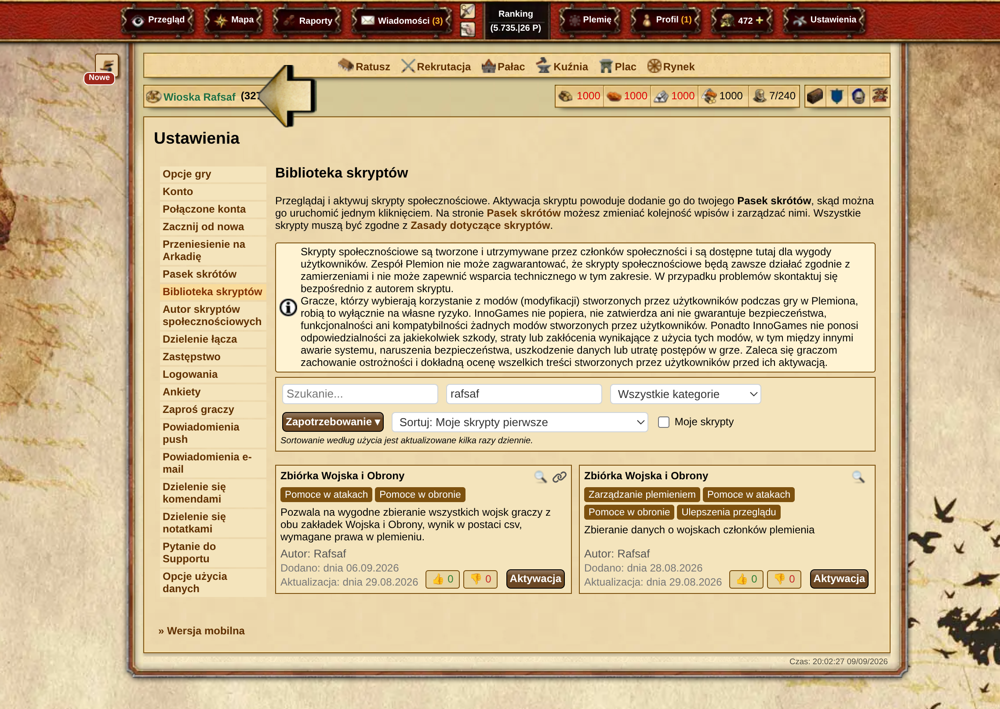
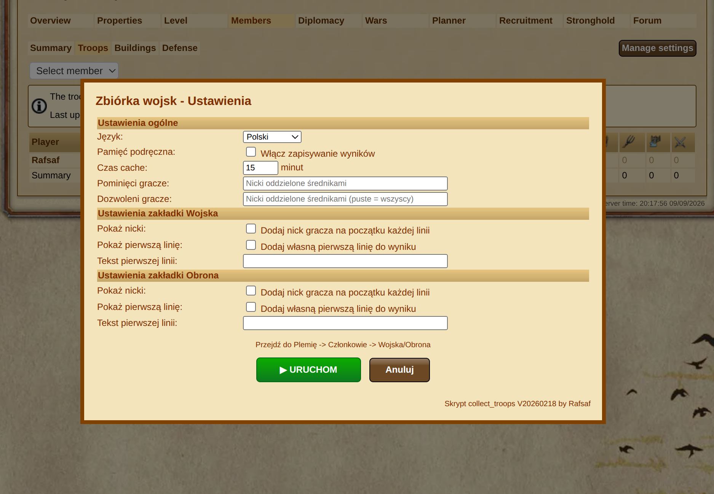

## Instalacja

Obecnie jedyną wspieraną opcją instalacji jest użycie **oficjalnej Biblioteki Skryptów** (Ustawienia -> Biblioteka Skryptów). Wyszukaj go po autorze – Rafsaf lub po nazwie.



| Serwer             | Nazwa w bibliotece skryptów    | Autor  | Kod                                                                                                                             |
| ------------------ | ------------------------------ | ------ | ------------------------------------------------------------------------------------------------------------------------------- |
| plemiona.pl        | Zbiórka Wojska i Obrony        | Rafsaf | [Kod na GitHubie (v20260218)](https://github.com/rafsaf/scripts_tribal_wars/blob/2026-02-18/public/collect_troops_v20260218.js) |
| tribalwars.net     | Collect troops script          | Rafsaf | [Kod na GitHubie (v20260218)](https://github.com/rafsaf/scripts_tribal_wars/blob/2026-02-18/public/collect_troops_v20260218.js) |
| guerretribale.fr   | Script de collecte des troupes | Rafsaf | [Kod na GitHubie (v20260218)](https://github.com/rafsaf/scripts_tribal_wars/blob/2026-02-18/public/collect_troops_v20260218.js) |
| tribals.it         | Raccolta delle truppe          | Rafsaf | [Kod na GitHubie (v20260218)](https://github.com/rafsaf/scripts_tribal_wars/blob/2026-02-18/public/collect_troops_v20260218.js) |
| guerrastribales.es | Script de colector de tropas   | Rafsaf | [Kod na GitHubie (v20260218)](https://github.com/rafsaf/scripts_tribal_wars/blob/2026-02-18/public/collect_troops_v20260218.js) |
| inne serwery       | -                              | -      | [Kod na GitHubie (v20260218)](https://github.com/rafsaf/scripts_tribal_wars/blob/2026-02-18/public/collect_troops_v20260218.js) |

!!! warning

    Skrypt jest dostępny na wielu wersjach językowych – zgłoś problem przez support na swoim serwerze aby go tam dodać jeśli nie jest wymieniony wyżej. Użycie na innych wersjach językowych gry **gdzie skrypt jest niedozwolony** przez obsługę może spowodować zablokowanie konta. Użycie na własne ryzyko.

=== "Wspierane serwery"

    Instalacja wyłącznie przez bibliotekę skryptów!

=== "Inne serwery"

    ```title="Skrypt Zbiórka Wojska i Obrony"
    --8<-- "army_script_latest.txt"
    ```

## Instrukcja użycia z Plemiona-Planer.pl

1. Utwórz skrypt do paska, przejdź do widoku plemienia, kliknij go
2. Zmień ustawienia (opcjonalnie) i naciśnij Uruchom
3. Poczekaj na wynik
4. Przejdź do wybranej rozpiski
5. Wklej dane i potwierdź

Ustawienia:



Wynik:


## Opis

Po kliknięciu na środku ekranu pojawia się "licznik" z postępem, potem wynik w okienku. Działa w obu zakładkach Wojska i Obrony. Domyślne ustawienia do skopiowania mają ustawione cache na true a cacheTime na 5 min, przez ten czas skrypt wypluwa wynik zapisany w przeglądarce zamiast od nowa latać po wszystkich członkach i zbierać dane. W razie wątpliwości czy mamy do czynienia z nowym czy starym wynikiem na dole pojawia się data zebrania.

Dane generowane w wyniku uruchomienia skryptu należy wklejać w rozpiskę na stronie.

Opcje:

- **Pamięć podręczna**: <boolean> (domyślnie: `true`) odpowiada za przechowywanie wyniku w przeglądarce, aby przypadkowo nie kliknąć kilka razy z rzędu i niepotrzebnie obciążać serwery gry. Gdy ustawimy `false`, skrypt nie będzie zapisywać wyniku w przeglądarce (użyteczne np. gdy zamierzamy zebrać dane od dwóch plemion skaczących od razu do drugiego). Uwaga: jeśli plemię ma ogromną liczbę wiosek, może to zająć zbyt dużo miejsca w `localStorage` (~max 5MB), dlatego limit wynosi 1MB. Jeśli dane wyjściowe są > 1MB, zapis do `localStorage` zostanie pominięty.

- **Czas cache**: <number> (domyślnie: `5`) to czas przechowywania wygenerowanego wyniku w przeglądarce, w minutach.

- **Pominięci gracze**: <string> (domyślnie: `""`) tutaj wpisujemy nicki graczy, od których nie chcemy zbierać przeglądów, oddzielając średnikiem jak przy wiadomościach, np. "Rafsaf;kmic;ktoś jeszcze".

- **Dozwoleni gracze**: <string> (domyślnie: `""`) tutaj wpisujemy nicki graczy, od których JEDYNIE chcemy zbierać przegląd. Pozostali zostaną pominięci, oddzielając nicki średnikiem jak przy wiadomościach, np. "Rafsaf;kmic;ktoś jeszcze". Uwaga: wartość domyślna `""` ma specjalne znaczenie i oznacza, że chcemy zbierać przegląd od wszystkich graczy.

- **Pokaż nicki**: <boolean> (domyślnie: `false`) gdy wartość to `true`, do wyniku zbiórki Wojska w każdej linijce zostanie dodany nick gracza, parametr podobny do `Pokaż nicki` dla zakładki Obrony.

- **Pokaż pierwszą linię**: <boolean> (domyślnie: `false`) gdy wartość to `true`, do wyniku zbiórki Wojska zostanie dodany nagłówek (pierwsza linijka u góry wyniku), którego wartość ustalamy w kolejnym parametrze `Tekst pierwszej linii`.

- **Tekst pierwszej linii**: <string> (domyślnie: `""`) wartość, która zostanie dodana w nagłówku w wyniku zbiórki Wojska, jeśli `Pokaż pierwszą linię` jest ustawione na `true`.

- **Pokaż nicki**: <boolean> (domyślnie: `false`) gdy wartość to `true`, do wyniku zbiórki Obrony w każdej linijce zostanie dodany nick gracza, parametr podobny do `Pokaż nicki` dla zakładki Wojska.

- **Pokaż pierwszą linię**: <boolean> (domyślnie: `false`) gdy wartość to `true`, do wyniku zbiórki Obrony zostanie dodany nagłówek (pierwsza linijka u góry wyniku), którego wartość ustalamy w kolejnym parametrze `Tekst pierwszej linii`.

- **Tekst pierwszej linii**: <string> (domyślnie: `""`) wartość, która zostanie dodana w nagłówku w wyniku zbiórki Obrony, jeśli `Pokaż pierwszą linię` jest ustawione na `true`.
