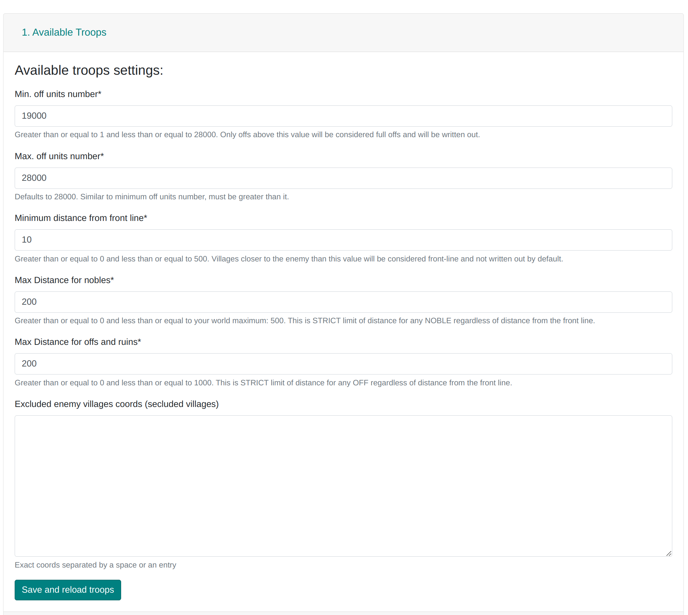

# 1. Tropas Disponíveis e descrição da tabela

Esta aba é usada para dividir as aldeias da nossa tribo em Linha de Frente e Retaguarda. Como a compreensão disso é fundamental para o uso do site, parte de sua descrição pode ser encontrada em outras abas, incluindo este artigo:
[As duas regiões da tribo: o que são a Linha de Frente e a Retaguarda](./../primary/two_regions_of_the_tribe.md).

- **Mín. de unidades off** e **Máx. de unidades off**

  Insira o intervalo de tamanho das ofensivas (em termos de população na fazenda) que devem ser planejadas.

  Por exemplo, se o intervalo for 10.000-12.000, o Planejador pulará tanto as ofensivas maiores que 12.000 quanto as menores que 10.000. O número máximo de exploradores considerados é 200; qualquer valor acima será ignorado. Os nobres são contados como x6 unidades apenas se **houver mais unidades ofensivas do que defensivas**. O código exato pode ser encontrado [aqui](https://github.com/rafsaf/Tribal-Wars-Planer/blob/ecc7ff31ed122928a7aea6199af4a0f9ce4718fd/utils/basic/army.py#L242-L250).

- **Distância mínima da linha de frente**

  O valor em campos usado para calcular a linha de frente, com base no qual as aldeias da linha de frente são determinadas. O código exato para a divisão em Linha de Frente/Retaguarda/Fora pode ser encontrado [aqui](https://github.com/rafsaf/Tribal-Wars-Planer/blob/ecc7ff31ed122928a7aea6199af4a0f9ce4718fd/utils/basic/cdist_brute.py#L83-L99). Toda a intuição por trás dessa divisão pode ser encontrada no guia [As duas regiões da tribo: o que são a Linha de Frente e a Retaguarda](./../primary/two_regions_of_the_tribe.md).

- **Distância máxima para nobres**

  Por padrão, este é o valor máximo da distância em campos para o mundo específico. Não é possível definir um valor maior (tais ataques não poderiam ser enviados).

- **Distância máxima para offs e ruínas**

  O Planejador não atribuirá ataques de aldeias mais distantes do inimigo do que este valor. Também é usado para fornecer um número aproximado de aldeias na região "Fora", ou seja, aquelas que serão puladas.

- **Coordenadas de aldeias inimigas excluídas (aldeias isoladas)**

  Insira todas as contas inativas inimigas dentro do território da nossa tribo. **Vale a pena** fazer isso porque com uma **Distância mínima da linha de frente** de, por exemplo, 10 campos, tudo ao redor de 10 campos das contas inativas inimigas será naturalmente considerado como linha de frente, e as ofensivas desta área serão puladas no plano. No entanto, às vezes é uma decisão melhor manter as ofensivas ao redor de ilhas para uso local e não inserir contas inativas inimigas aqui.
