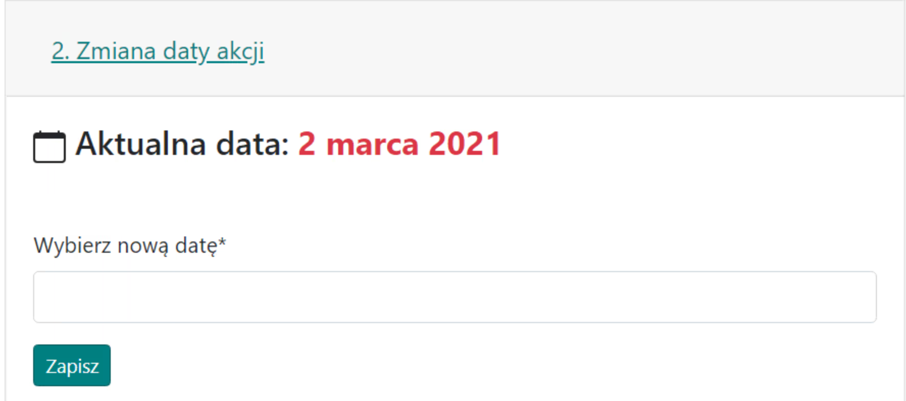

# 2. Definir a data

A aba é muito simples e é usada para alterar a data de entrada da ação, que foi inicialmente fornecida no início ao criar o plano.

Aparência da aba com uma data de exemplo:

{ width="600" }

Não há e não haverá a possibilidade de planejar uma ação para vários dias. A única possibilidade é planejar a ação para o primeiro dia, por exemplo, 01.01, enviar os resultados para os jogadores e, em seguida, na {==Aba de Resultados==}, após a conclusão do plano, você pode encontrar as unidades restantes e não utilizadas na aba {==Tropas Não Utilizadas==}. Ao criar um novo plano com uma data diferente, por exemplo, para o dia seguinte 02.01, e copiar os dados sobre as Tropas para lá, você pode planejar a ação para o dia seguinte.
