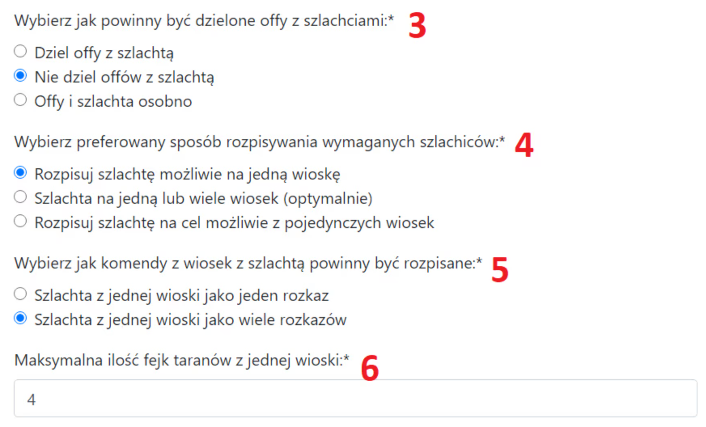

# 3. Parâmetros do Plano

Esta aba é usada para especificar os detalhes de onde exatamente as tropas ofensivas devem vir para uma operação, bem como outras configurações gerais do cronograma. Aperte os cintos.

A aparência da aba com as configurações padrão:

{ width="600" }

No artigo [As duas regiões da tribo: o que são a Linha de Frente e a Retaguarda](./../primary/two_regions_of_the_tribe.md), você aprendeu como o Planejador lida com a divisão em Linha de Frente, Retaguarda e Fora. Primeiro, vamos discutir os pontos 1 e 2 na imagem acima.

Nota, para todas as considerações abaixo, ignoramos todas as aldeias na região Fora. Elas são completamente ignoradas pelo Planejador, então nos concentramos apenas na Linha de Frente e na Retaguarda.

Configurações 1-2:

{ width="600" }

Você pode definir exatamente de quais partes da tribo as tropas ofensivas e os nobres devem vir por padrão. O padrão é Retaguarda Aleatória para tropas ofensivas e Linha de Frente Mais Próxima para nobres.

**Linha de Frente Mais Próxima** significa o mais próximo possível. Nem precisa ser necessariamente de aldeias na Linha de Frente. Se, por exemplo, não houver aldeias na linha de frente ou ao agendar automaticamente, apenas aldeias da retaguarda permanecerem em uma região (porque as da linha de frente foram usadas), então simplesmente as aldeias mais próximas serão escolhidas.

**Retaguarda Próxima** deve vir da Retaguarda, e entre elas, as mais próximas possíveis são selecionadas.

**Retaguarda Aleatória** são aldeias da Retaguarda, selecionadas de forma verdadeiramente aleatória (não pseudo-aleatória) de todas as opções possíveis. Esta é a configuração padrão para tropas ofensivas—geralmente, não queremos que nada (distância, jogador que envia) indique que é uma ofensiva e possa ser distinguida de fakes.

**Retaguarda Distante** são aldeias da Retaguarda, ordenadas na ordem oposta de Retaguarda Próxima, ou seja, as mais distantes possíveis.

!!! info

    Para maior diversão, que os defensores de ações planejadas nesta página sem dúvida sentirão, todas as configurações acima têm um grau mínimo de aleatoriedade. Isso significa que o mais próximo e o mais distante possível têm uma pequena flutuação. Isso ocorre porque, teoricamente, a Retaguarda Próxima e a Retaguarda Distante poderiam ser reconhecidas por um defensor, e desta forma será um pouco mais difícil de adivinhar, dependendo de quantos ataques estão agendados para uma aldeia. Quanto mais ataques, maior a flutuação.

Vamos passar para as configurações 3 a 6, que se concentram nas configurações gerais do cronograma.

Configurações 3-6:

{ width="600" }

**No ponto 3**, você decide como os nobres de uma aldeia devem ser divididos. Existem três opções usuais: Dividir (cada nobre com a mesma escolta), Não dividir (o primeiro nobre com a maior escolta, o resto com escolta mínima—note que isso não funciona bem com, por exemplo, 5 nobres quando eles são divididos em várias aldeias), e Separadamente, significando que todos os nobres têm escolta mínima, e as ofensivas vão separadamente antes deles—apenas para ações e usos específicos.

A opção mais sensata, especialmente para ações maiores, geralmente é dividir, embora o padrão seja não dividir, pois é assim que normalmente funciona para cronogramas menores.

**No ponto 4**, você tem três opções. Na primeira, o Planejador tenta pegar nobres para uma aldeia de diferentes aldeias de nossos jogadores (caso de uso: nobres de longe). Na segunda opção (padrão), ele faz isso de forma otimizada, enquanto na terceira opção, ele tenta enviar um conjunto de nobres de um jogador por aldeia ou, alternadamente, 3 nobres de um jogador e 1 nobre de outro, ou 2 e 2, enquanto provavelmente não haverá nobres individuais de diferentes aldeias. A terceira opção é a menos confiável e pode gerar resultados estranhos.

**No ponto 5**, você escolhe como os comandos para o ponto de encontro devem parecer para nossos jogadores no caso de múltiplos nobres de uma aldeia. Suponha que nosso jogador deva enviar 20k de ofensiva e 4 nobres para a aldeia `500|500`.

Na primeira opção, eles receberão UM link de ponto de encontro com 20k de ofensiva e 4 nobres.

Na segunda opção, padrão, eles receberão QUATRO links consecutivos de ponto de encontro para seus alvos, cada nobre tratado como uma ordem separada.

Qual opção no ponto 5 é melhor? Como de costume, depende. Para ações pequenas, provavelmente a segunda, opção padrão. Para ações muito grandes e massivas onde as ofensivas sempre serão divididas, a primeira opção é mais conveniente para os jogadores. Para outras ações, escolha o que for melhor para você. A opção padrão significa mais detalhes para o jogador (pois eles sabem exatamente qual escolta cada nobre tem), enquanto a primeira opção como uma única ordem significa menos detalhes e menos espaço ocupado.

**No ponto 6**, você escolhe quantos fakes podem ser enviados de uma de nossas aldeias no máximo.
