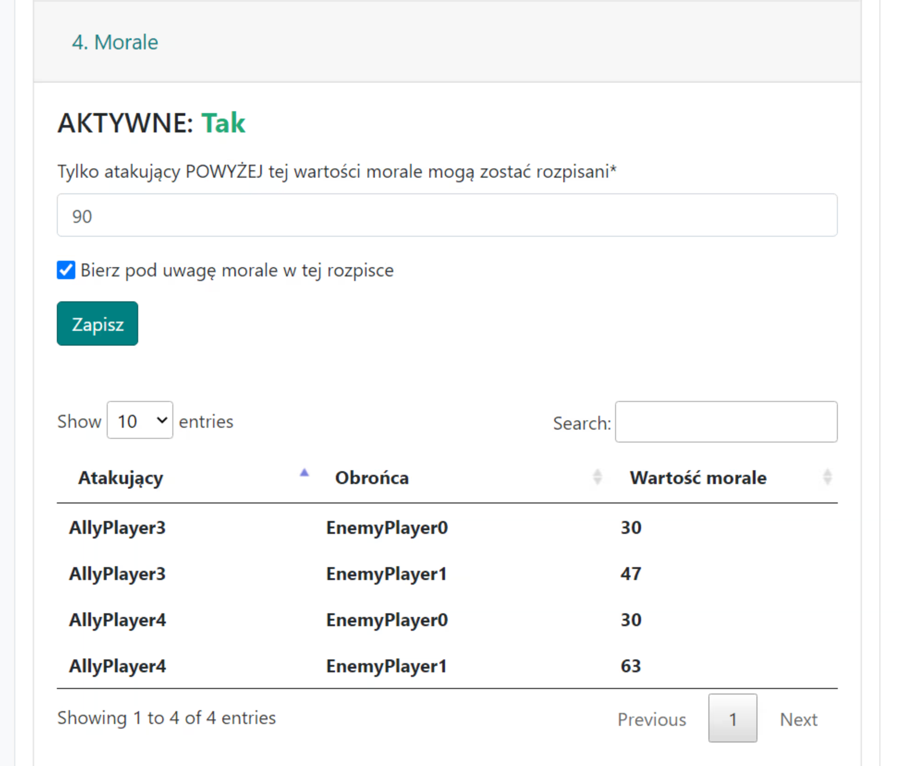

# 4. Moral

A aba é usada para controlar os valores de moral ao delinear as ações.

Configurações:

{ width="600" }

Nota: Por padrão, esta opção está desabilitada em todas as ações, mas você pode alterar esse comportamento indo em Menu -> Minha Conta.

O primeiro campo "Apenas atacantes ACIMA deste valor de moral podem ser usados" é usado para decidir qual é o valor de moral mais baixo aceitável para a ação. Frequentemente, este será um valor entre 90-100, dependendo da fase do mundo, dos alvos das ações, etc. O impacto no resultado da ação é tal que, para um determinado alvo (cada um individualmente!), a lista de todas as aldeias permitidas de onde os ataques poderiam ser delineados é filtrada, excluindo todas aquelas que não atendem aos nossos requisitos de moral.

Assim, em teoria, tendo entre muitos alvos alguns ou vários jogadores com um pequeno número de pontos, os ataques a eles serão delineados a partir de jogadores da tribo também com um número menor de pontos.

Em situações extremas, você pode desmarcar a segunda opção "Considerar moral neste plano", o que resulta em não considerar a moral.

Note que nas tribos, existem três configurações de moral em ordem de popularidade: baseada em pontos, baseada em pontos e tempo, e sem moral:

1. Moral baseada em pontos

   Para a configuração mais popular, a moral é baseada apenas nos pontos do jogador atacante e defensor, o que o Planejador implementa exatamente, embora as proteções iniciais presentes em alguns mundos não sejam consideradas (embora delinear ações com o Planejador em aldeias de jogadores que estão no mundo há menos de, por exemplo, 2 semanas pareça improvável).

2. Moral baseada em pontos e tempo

   Neste caso, além dos pontos, a moral é aumentada proporcionalmente ao tempo do defensor no mundo, até um valor máximo de 50%. O jogo não fornece este tipo de dados. No entanto, o Planejador coleta dados de todos os mundos em todos os servidores de jogos por muitos anos, portanto, os dados relativos ao tempo dos jogadores no mundo são obtidos (de um banco de dados interno mantido como parte do site). O resultado deve ser preciso e consistente com o jogo.

3. Sem moral

   Neste caso, a aba fica inativa e a questão da moral é ignorada.
