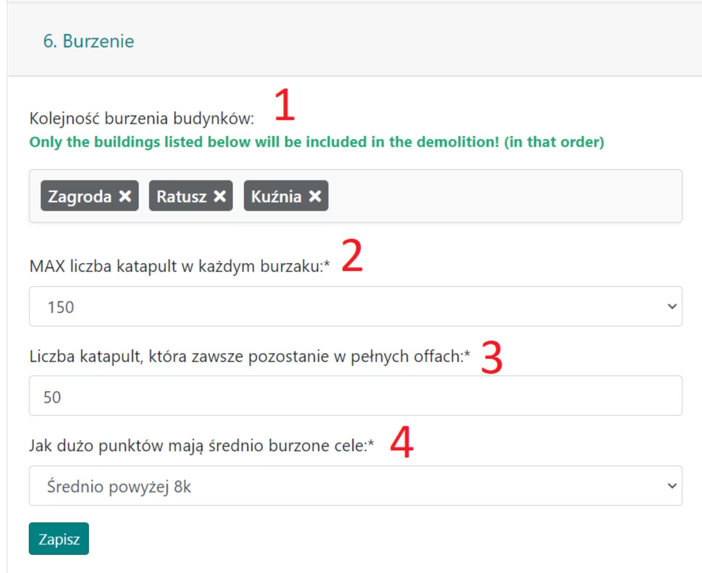

# 6. Demolição

Esta aba contém várias configurações relacionadas a ações de demolição.

Aparência da aba:

{ width="600" }

Na opção **1.**, a ordem dos edifícios a serem demolidos é definida. O Planejador agendará ataques a eles na ordem especificada, ignorando quaisquer edifícios pulados.

Em **2.**, definimos o número máximo de catapultas que serão agendadas (e depois quantidades progressivamente menores até 50 catapultas).

Em **3.**, escolhemos o número de catapultas em ofensivas completas que devem sempre permanecer nas aldeias (para serem enviadas junto com a ofensiva).

No último campo **4.**, podemos escolher o tamanho das aldeias a serem demolidas. Por padrão, são aldeias grandes e totalmente desenvolvidas com edifícios em torno de 9k pontos (portanto, mais catapultas são necessárias para destruir estruturas como a fazenda ou a ferraria em comparação com uma aldeia com 5k pontos). Escolhemos com base nas especificidades da nossa ação.
