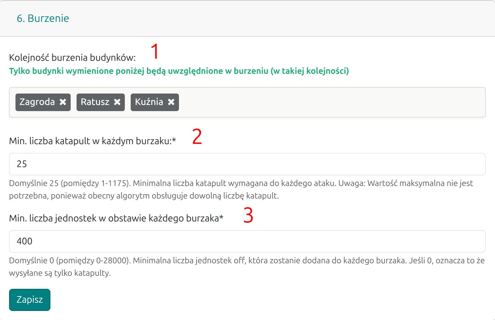

Esta aba contém várias configurações relacionadas a ações de demolição.

Aparência da aba:

{ width="600" }

Na opção **1.**, a ordem dos edifícios a serem demolidos é definida. O Planejador agenda ataques a eles na ordem especificada, ignorando qualquer edifício pulado.

Em **2.**, definimos a quantidade mínima de catapultas que uma aldeia deve ter para se qualificar para um ataque de ruína. Não existe mais um campo separado para máximo de catapultas. O planejador segue a tabela exata de destruição para o tipo de aldeia selecionado, então envia apenas a quantidade necessária para o próximo passo exato ou para destruir o edifício para nível 0, se houver mais catapultas disponíveis do que a tabela contém.

Em **3.**, escolhemos o número de unidades OFF em ataques de ruína que devem ser enviadas junto com as catapultas.

Os níveis dos edifícios são inferidos pelos pontos da aldeia de origem. Aldeias acima de 8.000 pontos usam a progressão de destruição para aldeias grandes, enquanto aldeias com 8.000 pontos ou menos usam a progressão para aldeias médias. O nível restante exato após cada etapa de destruição vem das tabelas internas, e o planejador verifica esse valor após cada golpe para escolher o próximo passo correto. Se houver mais catapultas disponíveis do que a tabela exige, ele continua destruindo até o nível 0, quando necessário.
