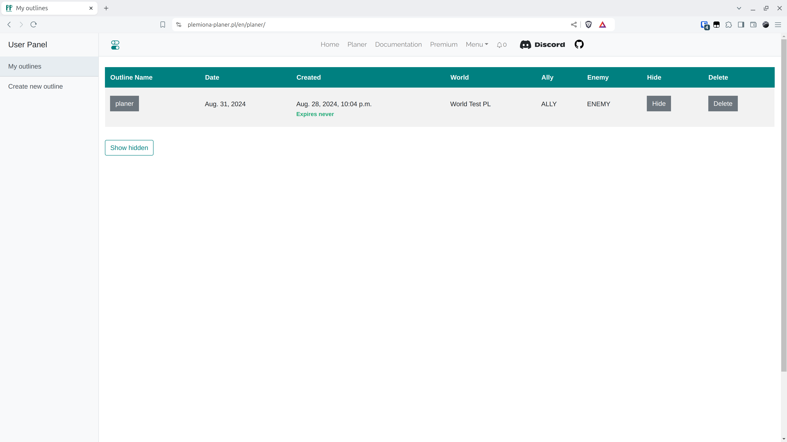

# Passo 3 - Preenchendo a Coleta de Exército

Para ir para o plano recém-criado, clique em seu nome.

<figure markdown="span">
  
  <figcaption>Clique em "planejador"</figcaption>
</figure>

Aqui, colamos os resultados gerados pelos scripts. Eles coletam informações sobre cada jogador em nossa tribo em um campo de texto, de onde copiamos e colamos no campo apropriado nesta aba. Aqui, essa saída é processada para garantir que as informações coladas façam sentido. Primeiramente, é verificado se todas as aldeias existem no mundo selecionado, se têm um proprietário ou se o proprietário está em uma das tribos que estabelecemos anteriormente. Em seguida, o comprimento, o número de vírgulas em cada linha (milícia, cavaleiros, arqueiros afetam o comprimento das linhas - se aparecerem, há mais números, etc.) e se não há espaços vazios no meio. No entanto, vale a pena saber que algo diferente do resultado do script não passará.

!!! warning

    Para ir para as próximas abas, é necessário colar os dados nesta aba. Sem inseri-los, você não pode prosseguir!

Para os propósitos do Mundo de Teste, cole os seguintes dados no campo de coleta de Exército.

=== "Coleta de Exército"

    ```title="army.txt"
    --8<-- "army.txt"
    ```

=== "Coleta de Defesa"

    ```title="defence.txt"
    --8<-- "defence.txt"
    ```

Em seguida, clique em Enviar.

<figure markdown="span">
  
  <figcaption>Cole e envie</figcaption>
</figure>
