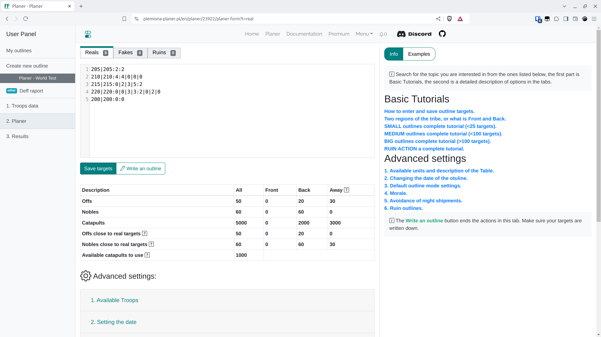

# Passo 4 - Salvar alvos e configurações e escrever um plano

Na aba Planejador, coloque os alvos do plano conforme descrito na aba. Clicando em {==Salvar alvos==}, atualizamos os alvos para os quais planejamos escrever o plano. Clicando em {==Escrever um plano==}, finalizamos esta parte e passamos para as próximas abas. Antes de começar a escrever seus próprios planos, leia as descrições do tipo que lhe interessa e é melhor experimentar definindo diferentes distâncias da Frente, distâncias máximas para nobres, alterar os modos avançados do plano, depois clicar em Escrever um plano e, em caso de resultados insatisfatórios, retornar clicando em **Voltar**.

No Mundo de Teste, cole os dados abaixo e salve.

=== "Reais"

    ```title="targets.txt"
    --8<-- "targets.txt"
    ```

!!! info

    Os alvos podem ser colados de várias maneiras. A maneira mais fácil é colar as próximas linhas apenas como coordenadas. Então, por padrão, o número de offs e nobres será preenchido como 0. O número de offs e nobres é mais facilmente codificado como, por exemplo, `coordenadas:2:2`, o que significa `coordenadas:dois-offs:dois-nobres`, ou mais precisamente, a entrada `cord:2:1|1|1|1` significará 2 offs e 1 nobre de perto, 1 de trás perto, 1 aleatoriamente, 1 de longe. Insira Fakes e Ruínas nas abas apropriadas da mesma maneira.

A aba inteira serve principalmente a dois propósitos: inserir alvos e configurações automáticas para atribuir planos. Para se familiarizar com o Mundo de Teste, completaremos apenas a tabela com aldeias da frente e de trás, visível sob os botões para salvar alvos e escrever planos. Se você estiver interessado nas outras abas, pode aprender mais sobre elas nas outras partes da documentação.

<figure markdown="span">
  
  <figcaption>Alvos salvos</figcaption>
</figure>

Expanda a primeira aba {==1. Tropas Disponíveis==}. Deixe todos os valores padrão. O objetivo é dividir todas as nossas aldeias em três grupos: Frente, Trás e Longe (muito distantes), dependendo das tribos inimigas inseridas (a distância para os inimigos mais próximos é contada para cada uma de nossas aldeias). Valide o formulário clicando em Salvar e recarregar tropas.

Você deve ver os seguintes resultados na tabela:

<figure markdown="span">
  
  <figcaption>Offs e nobres calculados perto dos alvos</figcaption>
</figure>

Agora clique em {==Escrever um plano==}, é hora da próxima aba :)

!!! info

    Para diferentes planos, a resolução será ligeiramente diferente. Para ações menores, por exemplo, na fase inicial dos mundos, vale a pena refinar cada objetivo separadamente em uma edição conveniente, mas para ações enormes é claro que é impossível. Então, você deve se concentrar mais na aba Planejador e nas configurações disponíveis lá.
