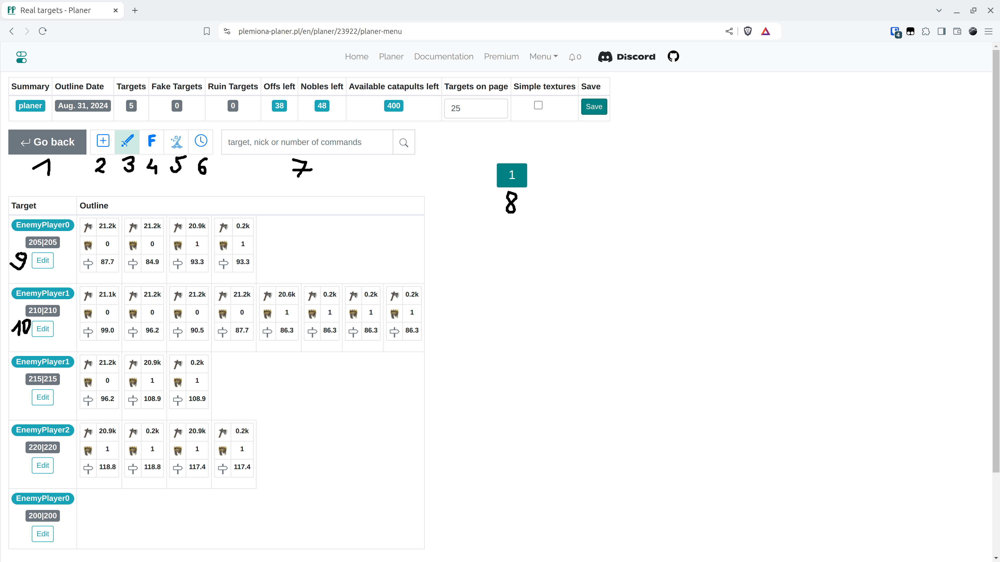
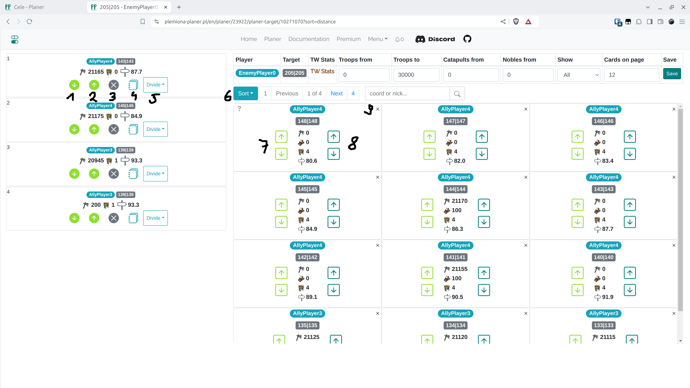

# Passo 5 - Edição do Plano

A próxima visualização é a ação baseada nas configurações da aba anterior. Há uma opção para edição manual de alvos individuais, adição de alvos e pesquisa.

<figure markdown="span">
  
  <figcaption>Aba de Menu</figcaption>
</figure>

| Número | Descrição                                                                      |
| ------ | -------------------------------------------------------------------------------- |
| 1      | Retornar à aba anterior, redefinir o cronograma                                   |
| 2      | Adicionar novos alvos manualmente                                                         |
| 3      | Visualizar alvos reais (aba atual)                                                  |
| 4      | Visualizar alvos falsos                                                                |
| 5      | Visualizar alvos para ruína                                                            |
| 6      | Aba para definir horários, discutida no [próximo passo](./step_6_set_time_finish.md) |
| 7      | Pesquisa                                                                           |
| 8      | Navegação entre páginas                                                         |
| 9,10   | Editar um único alvo de ataque                                                      |

Clique em "Editar" para o primeiro alvo (número 9). A visualização de edição de alvo único será aberta **em uma nova aba do navegador**.

<figure markdown="span">
  
  <figcaption>Editando um único alvo</figcaption>
</figure>

| Número | Descrição                                                                                                                 |
| ------ | --------------------------------------------------------------------------------------------------------------------------- |
| 1      | Mover a ordem para baixo                                                                                                         |
| 2      | Mover a ordem para cima                                                                                                           |
| 3      | Excluir a ordem (as unidades retornarão automaticamente para o pool livre no lado direito da tela)                         |
| 4      | Editar o número de unidades nesta ordem                                                                                      |
| 5      | Dividir em várias ordens                                                                                                  |
| 6      | Ordenar unidades livres e ainda disponíveis                                                                                            |
| 7      | Adicionar ofensas ao início ou ao fim                                                                                        |
| 8      | Adicionar ofensas junto com nobres ao início ou ao fim                                                                      |
| 9      | Ocultar a aldeia. Você também pode ocultá-la usando o filtro na parte superior da tela. Para vê-la novamente, altere a opção "Mostrar" |

Após fazer quaisquer alterações, {==feche a aba do navegador==}.
