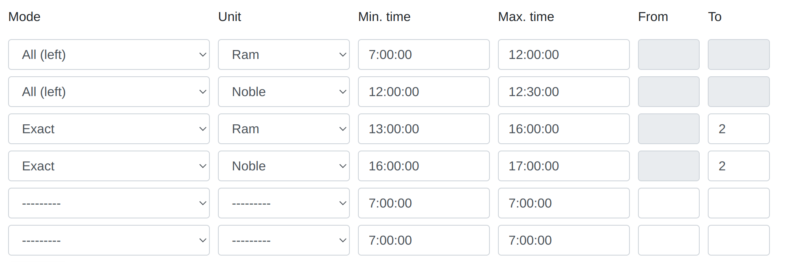

# Passo 6 - Definindo os Horários de Entrada e Finalizando o Plano

!!! info

    Após revisar todas as abas e possivelmente realizar operações na edição de alvos individuais, finalmente, para completar o cronograma, vá para a última aba com os horários.

<figure markdown="span">
  
  <figcaption>Aba de horários, você pode usar o horário muito simples acima e clicar em "Criar"</figcaption>
</figure>

O usuário tem a opção de criar múltiplos objetos de tempo de entrada na aba, mas na prática, até mesmo um ou alguns podem ser suficientes. Escolhemos os intervalos de tempo para os ataques, a unidade e o modo a partir de 3 opções possíveis. Um exemplo de um tempo complexo poderia ser assim:

<figure markdown="span">
  
  <figcaption>Exemplo 1.</figcaption>
</figure>

O que significa:

- Agendar um número aleatório de offs entre 0 e 5 entre 7:00 e 8:00 (ou menos se já tiverem sido usados)

- Agendar exatamente 3 offs entre 8:00 e 8:10 (ou menos se já tiverem sido usados)

- Agendar exatamente 4 nobres às 8:10 (ou menos, etc., como acima)

- Agendar todos os aríetes restantes, se houver, entre 12:00 e 12:30

- Agendar todos os nobres restantes às 12:30

Também é suportado que {==Todos os restantes==} possa ser anterior aos outros modos. No exemplo abaixo, o alvo sempre receberá 2 offs e 2 nobres no final do dia, e todo o resto (a quantidade pode ser definida de forma diferente para diferentes aldeias) pela manhã. Os horários fornecidos devem fazer sentido; o tempo máximo de entrada deve ser posterior ou o mesmo que o tempo mínimo de entrada. O modo Todos os restantes deve aparecer exatamente duas vezes: para as unidades Aríete e Nobre, ele tem a menor prioridade.

<figure markdown="span">
  
  <figcaption>Exemplo 2.</figcaption>
</figure>

Para os propósitos do mundo de teste, você pode criar um tempo simples a partir da primeira imagem e defini-lo para todos os alvos no topo da aba. Em seguida, finalize o cronograma clicando em {==Finalizar o Plano==}.

Você prosseguirá automaticamente para a próxima aba com os resultados.
