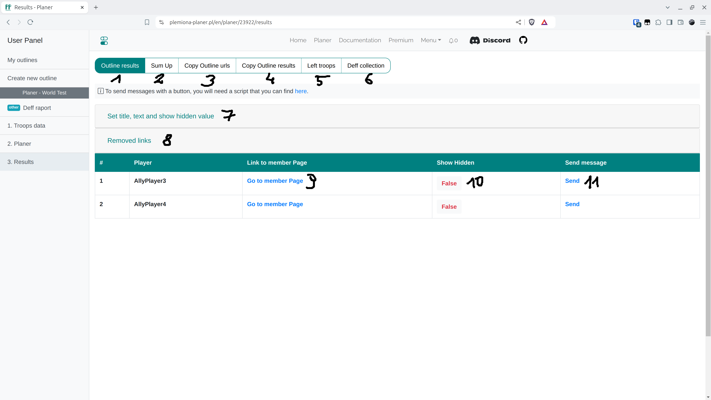

# Passo 7 - Aba de Resultados

<figure markdown="span">
  
  <figcaption>Aba de Resultados.</figcaption>
</figure>

| Número | Descrição                                                                                                                          |
| ------ | ---------------------------------------------------------------------------------------------------------------------------------- |
| 1      | Tabela com links para alvos de jogadores e links para envio, bem como um formulário para alterar o conteúdo das mensagens enviadas |
| 2      | Breve resumo em texto dos apelidos e alvos                                                                                         |
| 3      | Campo de texto com links que podem ser enviados manualmente aos jogadores                                                          |
| 4      | Resultados do plano como um texto completo a ser enviado (todos os jogadores)                                                      |
| 5      | Tropas não utilizadas para o próximo plano (PREMIUM)                                                                               |
| 6      | Resultados da coleta de defesa da aba COLETA DE DEFESA                                                                             |
| 7      | Formulário para o conteúdo da mensagem enviada e ocultação de ordens de outros jogadores                                           |
| 8      | Tabela com links antigos disponíveis para este plano                                                                               |
| 9      | Este link leva a uma página única com os alvos do jogador                                                                          |
| 10     | Opção manual para alterar a visibilidade das ordens de outros jogadores                                                            |
| 11     | Link para enviar uma mensagem no jogo, requer [Script para envio de mensagens](./../scripts/sending_messages.md)                   |

!!! info

    Uma {==URL ÚNICA==} foi criada para cada jogador, onde apenas seus alvos são apresentados, juntamente com um texto para colar nas notas e uma apresentação gráfica de suas ordens. Você pode acessá-los clicando no botão 9 na imagem acima. Após inserir o link, o jogador tem tudo o que precisa para enviar as tropas planejadas no plano.

Ao expandir {==Definir título, texto e mostrar valor oculto==}, que é o número 7, você especifica o conteúdo da mensagem enviada aos jogadores e se os jogadores devem ver as ordens de outros jogadores nos detalhes de seus alvos individuais. Por padrão, Mostrar oculto - Falso significa que eles veem apenas suas ordens e as ordens de outros apenas se estiverem atacando aquela aldeia com nobres de perto. Definir Mostrar oculto - Verdadeiro permite que os jogadores vejam todas as ordens dos outros. Sob o número 8, você encontrará uma tabela com todos os links criados; após cada confirmação de plano, novos são criados enquanto os antigos vão para esta aba (mas permanecem ativos!).

Nota! Com o tempo e com o desenvolvimento do aplicativo, os links removíveis foram alterados (e permanecerão) para links não removíveis, que o usuário não pode alterar ou bloquear o acesso, por exemplo, após enviar para a pessoa errada. Esta convenção garante que o agendador não exclua acidentalmente links já enviados, o que causaria grandes mal-entendidos. Os links ficam ativos por 30 dias, independentemente de o plano ainda existir ou ter sido excluído.
