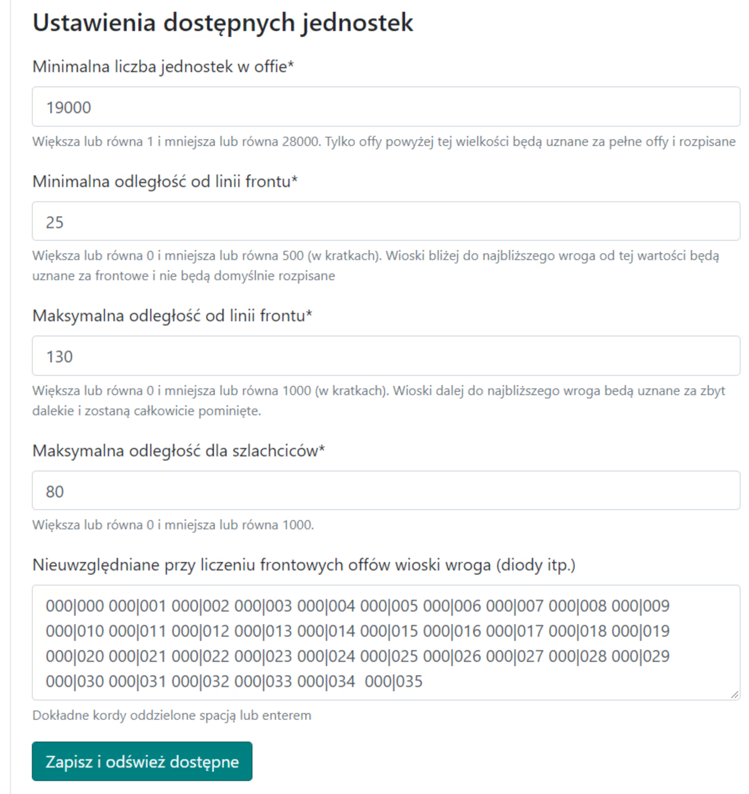
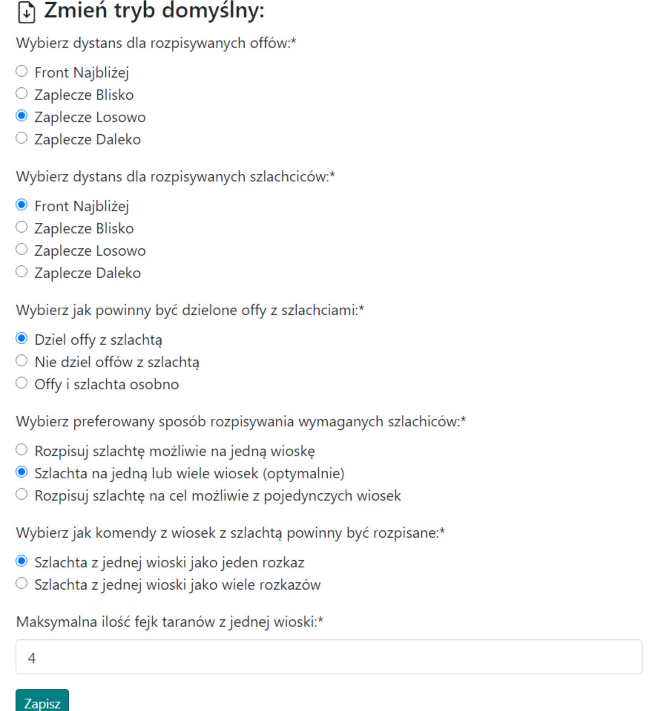

# Planos Grandes - Guia

Nota: a ideia para grandes ações apresentada abaixo não é obrigatória, pode ser feita de qualquer maneira.

Neste guia, você verá como planejar de forma mais eficaz e eficiente uma grande ação, em última análise, na fase final do mundo, para mais/muito mais de 100 alvos, onde apenas ataques completos são levados em conta durante a ação na tribo. Nota: presume-se que você já tenha todo o conhecimento de [Primeiros Passos com o Planejador](./../first_steps/index.md)! e é recomendado ler primeiro os dois guias curtos anteriores nesta seção, ou seja, [Como Inserir e Salvar Alvos de Ação](./two_regions_of_the_tribe.md) e [Duas Regiões da Tribo: O que é Frente e Retaguarda](./two_regions_of_the_tribe.md).

!!! hint

    Sempre comece a planejar qualquer ação nesta página contando todos os ataques e dividindo-os em Frente e Retaguarda de acordo com o espírito do plano dado. Para este propósito, use a aba 1. Unidades Disponíveis, e os resultados são apresentados na tabela sob os alvos.

Planejaremos a ação usando o planejamento automático devido ao número de alvos e usaremos todas as opções avançadas disponíveis. Não usaremos opções de edição manual de alvos; toda a ação de A a Z será criada na primeira aba, depois apenas definiremos os horários de entrada e enviaremos os alvos prontos.

Para uma grande ação, a aba preenchida pode ter a seguinte aparência:

{ width="600" }

Defina o número mínimo no ataque para um ataque completo, cerca de 19k ou um pouco menos se os envios planejados forem em alguns dias e os ataques tiverem tempo de se desenvolver completamente até lá (apenas ataques acima disso serão mostrados na tabela), a distância da linha de frente para cerca de 10-45, dependendo de como a frente se parece. Se o oponente tiver diodos no território da tribo, exclua-os colando-os no campo Não Considerado ao Contar Ataques de Frente. Clique em Salvar e Atualizar Disponíveis. A tabela com o número de nossos ataques será preenchida.

A tabela preenchida deve se parecer com algo assim:

{ width="600" }

Nota: as duas últimas linhas da tabela só aparecerão depois que completarmos os alvos, pois as quantidades inseridas lá dependem de quais alvos são salvos (os ataques e a nobreza são contados em torno deles). Portanto, no início, haverá zeros lá. Você pode prosseguir para inserir alvos dependendo do número de ataques e nobreza que você tem. Em seguida, você pode recontar as Unidades Disponíveis.

Exemplo de alvos inseridos:

{ width="600" }

Se alguns alvos precisarem de configurações diferentes das padrão, use a codificação estendida de ataques e nobreza descrita no artigo Como Inserir e Salvar Alvos de Ação. Em seguida, vá para a aba 3. Parâmetros do Plano para definir as configurações para este plano, uma descrição detalhada de todas as opções em caso de dificuldades pode ser encontrada no tópico dedicado a ele, ou seja, 3. Parâmetros do Plano.

Configurações de exemplo para uma grande ação:

{ width="600" }

Além disso, você pode definir a moral na [aba 4](./../advanced/4_morale.md).

A última coisa que você deve considerar é a [aba 5: Evitando Envios com Bônus Noturno](./../advanced/5_avoid_night_bonus.md), provavelmente será benéfico, pelo menos para os jogadores e sua saúde, devido ao número reduzido ou eliminação de envios no meio da noite :)

Depois de inserir todos os alvos, alterar as configurações da ação e, possivelmente, o bônus noturno, prossiga para a próxima parte do plano clicando em Planejar esta Ação, depois verifique se tudo está OK e, possivelmente, retorne com o botão Voltar, altere as configurações. Em seguida, como de costume, vá para a aba Horários, defina os horários de entrada, finalize o plano e envie os alvos para os jogadores.
