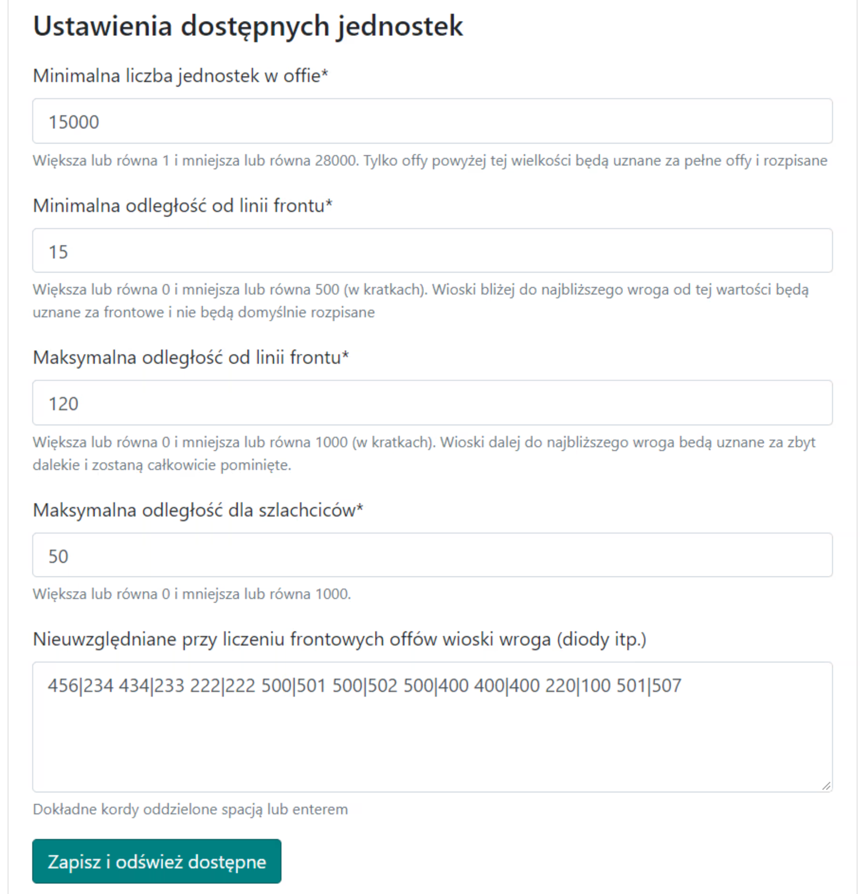

# Planos Médios - Guia

Nota: a ideia para ações médias apresentada abaixo não é obrigatória, pode ser feita de qualquer maneira, até mesmo tratando-as como ações pequenas ou grandes.

Neste guia, você verá como planejar de forma mais eficaz e eficiente uma ação média, em última análise, em uma fase um pouco mais avançada do mundo, para menos de 100 alvos, onde a tribo já tem principalmente ataques completos ou um pouco menores durante a ação. Nota: presume-se que você já tenha todo o conhecimento de [Primeiros Passos com o Planejador](./../first_steps/index.md)! e é recomendado ler primeiro os dois guias curtos anteriores nesta seção, ou seja, [Como Inserir e Salvar Alvos de Ação](./two_regions_of_the_tribe.md) e [Duas Regiões da Tribo: O que é Frente e Retaguarda](./two_regions_of_the_tribe.md).

!!! hint

    Sempre comece a planejar qualquer ação nesta página contando todos os ataques e dividindo-os em Frente e Retaguarda de acordo com o espírito do plano dado. Para este propósito, use a aba 1. Unidades Disponíveis, e os resultados são apresentados na tabela sob os alvos.

Planejaremos a ação usando o planejamento automático devido ao número de alvos e usaremos todas as opções avançadas disponíveis. Se necessário, você pode alterar as configurações individualmente para cada alvo, seja na Aba 4, alterando o modo de planejamento para ele, ou finalmente, após criar o plano, editando manualmente os alvos selecionados, como no caso de ações pequenas.

Para uma ação média, a aba preenchida pode ter a seguinte aparência:

{ width="600" }

Defina o número mínimo no ataque para uma quantidade apropriada, provavelmente mais de 10000 (apenas ataques acima disso serão mostrados na tabela), a distância da linha de frente para cerca de 5-25, se o oponente tiver diodos no território da tribo, exclua-os colando-os no campo Não Considerado ao Contar Ataques de Frente. Clique em Salvar e Atualizar Disponíveis. A tabela com o número de nossos ataques será preenchida.

A tabela preenchida deve se parecer com algo assim:

{ width="600" }

Nota: as duas últimas linhas da tabela só aparecerão depois que completarmos os alvos, pois as quantidades inseridas lá dependem de quais alvos são salvos (os ataques e a nobreza são contados em torno deles). Portanto, no início, haverá zeros lá. Você pode prosseguir para inserir alvos dependendo do número de ataques e nobreza que você tem. Em seguida, você pode recontar as Unidades Disponíveis.

Exemplo de alvos inseridos:

{ width="600" }

Se necessário, use a codificação estendida de ataques e nobreza descrita no artigo Como Inserir e Salvar Alvos de Ação. Em seguida, vá para a [aba 3. Parâmetros do Plano](./../advanced/3_outline_parameters.md) para definir as configurações para este plano, ou use a sintaxe estendida mencionada para os alvos.

Configurações de exemplo para uma ação média:

{ width="600" }

Opcionalmente, você pode deixar o padrão Nobreza de uma aldeia como múltiplas ordens se preferir que os jogadores recebam ordens separadas para a nobreza. No entanto, vale a pena alterar o Número máximo de aríetes falsos de uma aldeia para um pouco menos que o padrão 4 e definir a opção Dividir ataques com nobreza, que terá um desempenho melhor em ações um pouco maiores.

Além disso, você pode definir a moral na [aba 4](./../advanced/4_morale.md).

A última coisa que você deve considerar é a [aba 5: Evitando Envios com Bônus Noturno](./../advanced/5_avoid_night_bonus.md), provavelmente será benéfico, pelo menos para os jogadores e sua saúde, devido ao número reduzido ou eliminação de envios no meio da noite :)

Depois de inserir todos os alvos, alterar as configurações da ação e, possivelmente, o bônus noturno, prossiga para a próxima parte do plano clicando em Planejar esta Ação, depois verifique if tudo está OK e, possivelmente, retorne com o botão Voltar, altere as configurações. Em seguida, como de costume, vá para a aba Horários, defina os horários de entrada, finalize o plano e envie os alvos para os jogadores.
