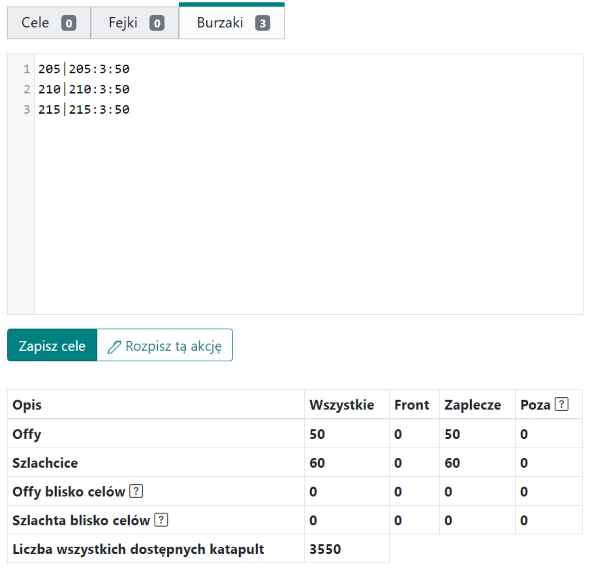

Neste guia, você aprenderá a planejar ações de destruição, especificamente voltadas para as fases posteriores do mundo. Nota: este guia pressupõe conhecimento completo de [Primeiros Passos com o Planejador](./../first_steps/index.md)! Também é recomendado ler primeiro os dois guias curtos anteriores nesta seção, isto é, [Como Inserir e Salvar Metas de Ação](./two_regions_of_the_tribe.md) e [As Duas Regiões da Tribo, ou seja, o que é a Frente e a Retaguarda](./two_regions_of_the_tribe.md).

!!! hint

    Sempre comece a planejar qualquer ação nesta página contando todas as tropas e dividindo-as em tropas da Frente e da Retaguarda, de acordo com a natureza do plano específico. Para isso, use a aba 1. Unidades Disponíveis, e os resultados são apresentados em uma tabela abaixo das metas.

A ação é criada no campo **Unidades de Cerco** ao lado das metas. As configurações na aba {==6. Unidades de Cerco==} determinam a ordem dos edifícios a serem destruídos e a quantidade mínima de catapultas que uma aldeia precisa ter para se qualificar para ataques de destruição. A progressão exata da destruição vem das tabelas internas de ruína, então o planejador verifica o nível restante após cada ataque e envia apenas a quantidade necessária para o próximo passo exato.

Exemplo de metas de destruição e resultados da tabela, com 3 unidades de ataque e \*50 unidades de cerco:

{ width="600" }

Exemplo de configurações de ação de destruição, visando 3 edifícios visíveis nesta ordem:

{ width="600" }

Você pode estimar o número de unidades de cerco disponíveis usando a aba {==1. Unidades Disponíveis==} e matemática simples. Após cada atualização, você pode encontrar o número total de catapultas prontas para o planejamento na tabela em **Número de Todas as Catapultas Disponíveis**. Você só precisa decidir para quantas metas elas serão suficientes.

Exemplo de uma mini-ação planejada com vários números de catapultas de 200 a 50:

{ width="600" }

## Seleção Exata de Catapultas para Destruição

Aldeias com mais catapultas disponíveis são atribuídas primeiro, mas o planejador não usa um limite máximo separado de catapultas. Em vez disso, ele sempre segue a tabela exata de destruição para o tipo de aldeia selecionado. A mesma lógica é usada tanto no passo ruin-off quanto no ataque de destruição, então o nível restante exato do edifício após cada golpe é comparado com a tabela e o planejador continua até que o edifício seja destruído para nível 0, quando necessário.

Isso significa que o planejador verifica o nível exato restante do edifício após cada golpe e continua com o próximo passo correto na tabela de destruição. Se houver mais catapultas disponíveis do que a tabela exige, o edifício será destruído até o nível 0, quando necessário.

## Unidades de Ataque Antes das Unidades de Cerco

As unidades de ataque programadas antes dos ataques de destruição compartilham o mesmo cronograma de dano ao edifício dos ataques de ruína posteriores. Suas ordens continuam sendo OFFs padrão, mas suas catapultas avançam o estado do edifício do alvo de destruição.

## Ordem de Destruição de Edifícios

Nas configurações {==6. Destruição==}, podemos alterar a ordem dos edifícios a serem destruídos. É importante lembrar que os edifícios não incluídos nesta lista são ignorados, e o algoritmo para em dois casos: ou não há mais catapultas para planejar, ou todos os edifícios listados já foram destruídos. Isso significa que, mesmo que decidamos escrever `000|000:0:1000`, 1000 unidades de cerco provavelmente não serão planejadas — quando os edifícios listados forem destruídos, o Planejador passa para os próximos passos (por exemplo, a próxima meta, etc.).

## Vejo 10.000 Catapultas Disponíveis. Quantas Metas São?

A resposta é: depende. Principalmente da ordem de construção escolhida. Vamos supor que apenas um edifício seja escolhido, **[ Ferraria ]**. Neste caso, 200-250 catapultas (por exemplo, 200 e 50, ou 100, 100, ou 50, 50, 50, 50 etc.) são suficientes para destruir uma aldeia, então você pode planejar 40-50 metas. Se dois edifícios forem escolhidos, **[ Ferraria, Fazenda ]**, você precisará de 200-250 catapultas para a Ferraria e 500-700 catapultas para a Fazenda (por exemplo, 14x 50, ou 5x 100, 4x 150, 3x 200 catapultas, ou muitas outras combinações), o que significa 700-950 catapultas por aldeia, ou 10-14 metas. Abaixo está uma tabela simples para edifícios de 30 níveis (como Fazendas, Armazéns, todos os edifícios ecológicos) e edifícios de 20 níveis (Quartel General, Ferraria) para ajudar a calcular quantas metas são possíveis.

|                        | Número de Catapultas Necessárias para a Destruição Completa do Edifício |
| ---------------------- | ----------------------------------------------------------------------- |
| Edifícios de 20 níveis | 200-250                                                                 |
| Edifícios de 30 níveis | 500-700                                                                 |

## Tamanho da Aldeia e Tabela de Destruição

A tabela exata de destruição é selecionada com base nos pontos da aldeia. Aldeias acima de 8.000 pontos usam a progressão de destruição para aldeias grandes, enquanto aldeias com 8.000 pontos ou menos usam a progressão para aldeias médias. Em outras palavras, uma aldeia não é avaliada por um campo redundante de catapultas máximas; o valor em pontos indica ao planejador qual tabela usar.

## Resumo

Lembre-se de que, em sua essência, o planejamento continua sendo baseado em um algoritmo guloso simples, e o Planejador **SEMPRE** atribui unidades de cerco, fakes ou offs de forma muito semelhante. Se você quiser que unidades de ataque ou de cerco sejam indistinguíveis de fakes, precisará planejar muitos fakes. Ao planejar a destruição, vale a pena habilitar a opção **Fakes de Todas as Aldeias** na {==Aba 3. Configurações Padrão da Ação==}, que, ao contrário da configuração padrão, atribui fakes de todas as aldeias da retaguarda.

O detalhe final importante é que o planejamento de destruição agora segue os valores exatos da tabela em vez de heurísticas simplificadas, então o comportamento é mais preciso e mais fácil de prever. Considere o número de catapultas e os edifícios que valem a pena destruir, e planeje muitos fakes. Aproveite a demolição!

