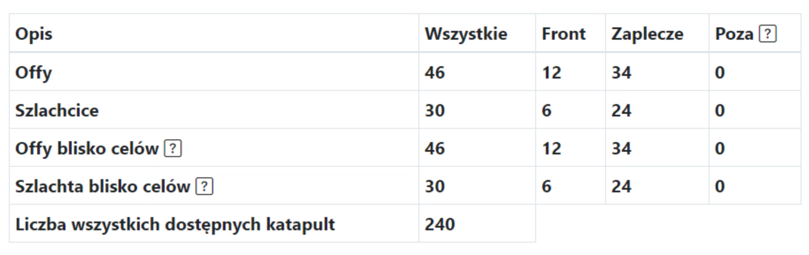
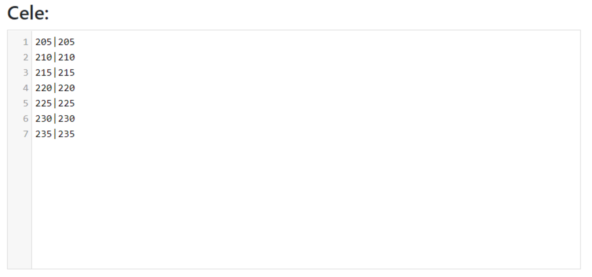

# Planos Pequenos - Guia

Nota: a ideia para pequenas ações abaixo não é vinculativa, pode ser feita de qualquer maneira, até mesmo tratando-as como ações médias.

Neste guia, você verá como delinear de forma mais eficaz e eficiente uma pequena ação, idealmente na fase inicial do mundo, com menos de 25 alvos (na prática, não há limite, mas o método apresentado se tornará cada vez mais demorado à medida que o número de alvos aumenta). Nota: todo o conhecimento de [Primeiros passos com o Planejador](./../first_steps/index.md) é assumido!

!!! hint

    Sempre comece a delinear qualquer ação nesta página contando todos os ataques e dividindo-os em Frente e Trás de acordo com o espírito do plano dado. Para este propósito, use a aba 1. Unidades disponíveis, e os resultados são apresentados em uma tabela sob os alvos.

A ideia é delinear manualmente as ordens para todos os alvos e não usar a opção de delineamento automático. Existem várias razões para isso: quando os jogadores não têm ataques completos, muitos pesados, e as distâncias para os inimigos não são razoáveis (misturar-se com o inimigo não é razoável), o delineamento automático de ações perde o sentido. Pode ser feito com precisão e rapidez manualmente - mas manualmente com a ajuda do Planejador!, o que acelera ao máximo a criação do plano e a distribuição de alvos. Foi inicialmente criado para pequenas ações, nas quais é o melhor. Toda a sobreposição para ações maiores é uma adição posterior.

Para uma pequena ação, a aba preenchida pode ter a seguinte aparência:

{ width="600" }

Defina o número mínimo no ataque para um valor adequado e **pequeno, por exemplo, 2000**, (apenas ataques acima disso serão mostrados na tabela), a distância da linha de frente também pequena, ou seja, **1-10 campos**. Clique em Salvar e atualizar disponíveis. A tabela com o número de nossos ataques será preenchida.
A tabela preenchida deve se parecer com algo assim:

{ width="600" }

Nota: as duas últimas linhas da tabela aparecerão apenas depois que completarmos os alvos, pois as quantidades inseridas lá dependem de quais alvos são salvos (é em torno deles que esses ataques e nobres são contados). Portanto, no início, haverá zeros lá. Você pode prosseguir para inserir alvos dependendo do número de ataques e nobres que você tem. Em seguida, você pode recontar as unidades disponíveis.

{ width="600" }

Após inserir as coordenadas como acima e salvá-las, cada linha se parecerá com 000|000:0:0.
Ignoramos todas as outras configurações avançadas, deixando 0 ataques e 0 nobres em cada linha e clicamos em Delinear esta ação.

Após passar para a próxima aba, notaremos que todos os alvos estão vazios. Procedemos à edição de todos os alvos sequencialmente clicando em Editar e delineamos as ordens dos jogadores mais próximos na ordem escolhida, opções de ordenação além do padrão Ascendente por distância, Ataques completos mais próximos e Nobres mais próximos serão úteis.

Acima é mostrado como um alvo pode se parecer na fase inicial do jogo, 2 ataques no início, depois 4 nobres. Lembre-se que após adicionar tropas, seu status é atualizado em todos os alvos (em outras palavras, está bem programado, você não delineará mais tropas do que o máximo possuído pelos jogadores). Após delinear todos os alvos, prossiga para a aba Tempos da maneira já conhecida do Mundo de Teste, defina os tempos de entrada, complete o plano e envie aos jogadores seus alvos.
