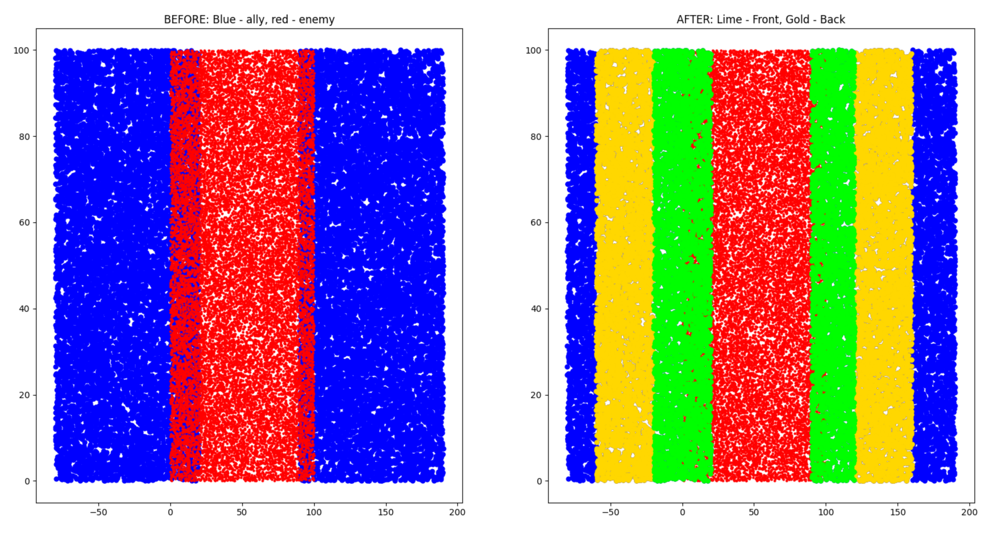
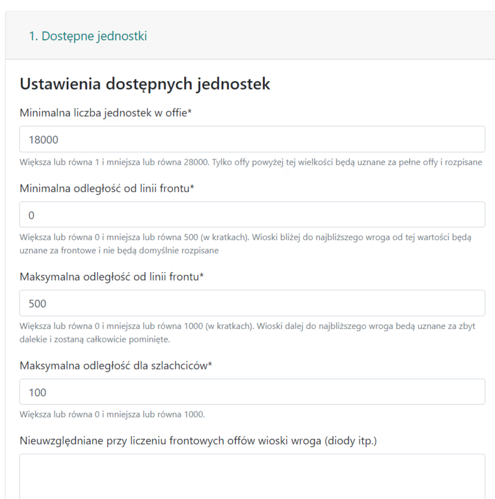
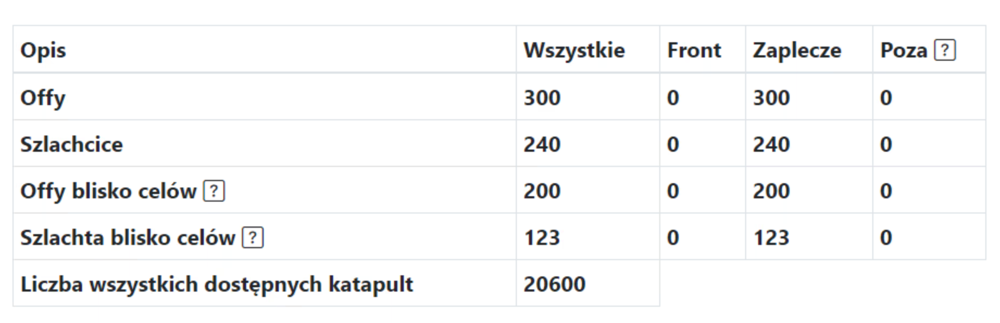
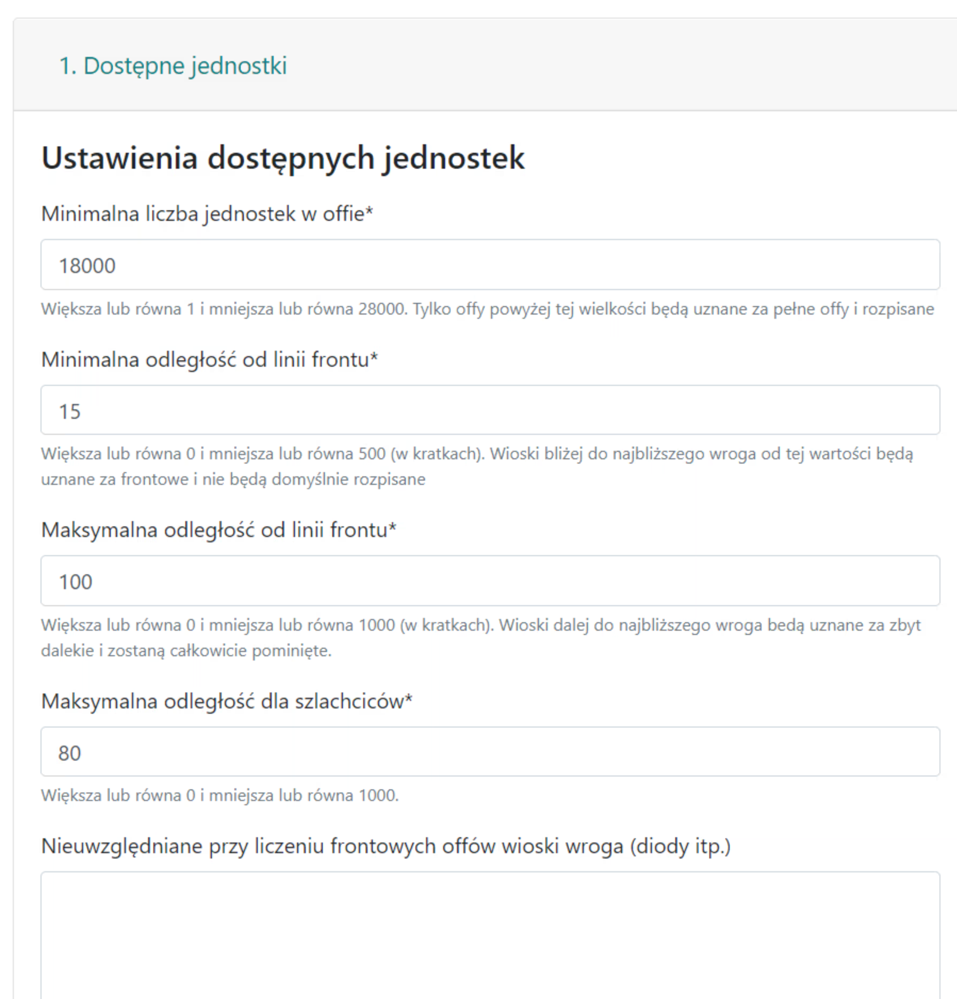
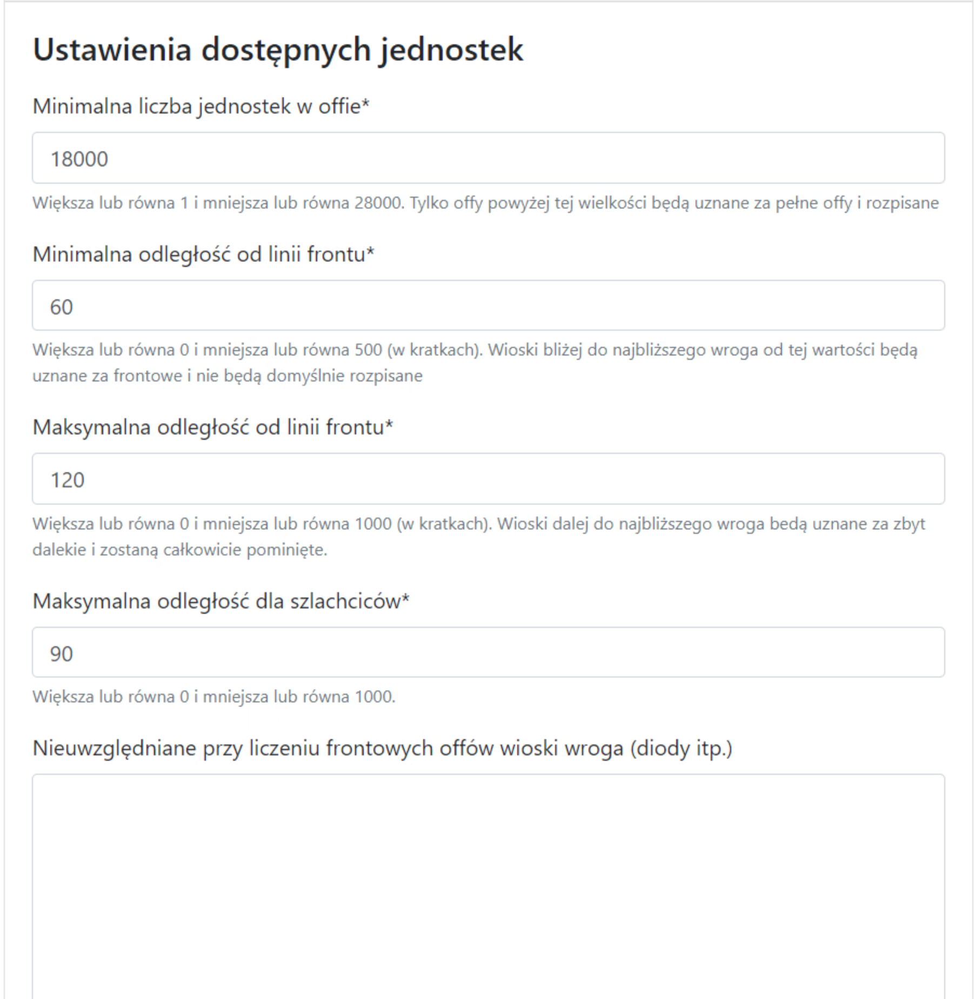

# Duas regiões da Tribo - frente e retaguarda

!!! hint

    Sempre comece a escrever qualquer ação nesta página contando todos os ataques e dividindo-os em Frente, Retaguarda e Além, de acordo com o espírito da lista fornecida. Para este propósito, use a aba 1. Unidades disponíveis, e os resultados são apresentados na tabela sob as metas.

## Intuição

A resposta para não atribuir ataques frontais a homens da frente que deveriam guardá-los para finalizações de perto (ou usá-los de qualquer outra forma) durante o planejamento da ação é dividir nossas aldeias em dois grupos principais: Frente, que inclui ataques e nobreza perto do inimigo, e Retaguarda, que inclui ataques e nobreza longe do inimigo. A partir da versão 2.1.0, outra região chamada Além foi adicionada, indicando intuitivamente aldeias muito distantes (mas há mais exemplos de aplicações), resolvendo o problema de ataques de muito longe, que não são desejados, mas também permitindo ações com ataques no alcance de, por exemplo, 20 a 80 ladrilhos. Como isso acontece exatamente e como controlá-lo será explicado em breve.

Toda a intuição relacionada à divisão pode ser resumida nas seguintes imagens:

<figure markdown="span">
  
  <figcaption>Exemplo 1. Divisão em frente e retaguarda, verde para frente e amarelo para retaguarda</figcaption>
</figure>

<figure markdown="span">
  
  <figcaption>Exemplo 2. Divisão em frente e retaguarda, vermelho para o inimigo e ao redor dele nossa tribo, verde para frente e amarelo para retaguarda</figcaption>
</figure>

Nossas tribos (em azul) cercam o inimigo (em vermelho), a imagem da esquerda mostra o estado ANTES da aplicação do algoritmo, e a da direita DEPOIS de sua aplicação. Dividimos todas as nossas aldeias em "setores" dependendo da distância do inimigo: mais próximo do vermelho - Frente, um pouco mais longe, mas não muito - Retaguarda, e aldeias muito distantes permaneceram azuis e indicam Além.

Como nossos ataques e nobreza serão divididos depende das configurações na aba 1. Unidades disponíveis, vamos considerar algumas possibilidades populares.

!!! info

    Ataques próximos aos alvos e nobreza próxima aos alvos funcionam de forma idêntica a Ataques e Nobreza, exceto que, em vez de considerar "todos" os inimigos e dividir em regiões com base nisso, eles consideram apenas os alvos inseridos pelo Usuário em Metas. Este é um resultado muito mais preciso porque se sabe quantas unidades temos disponíveis perto dos alvos (isso pode variar muito do que temos em toda a tribo).

## Exemplo 1

Resultado de exemplo para mín. 0 ladrilhos e máx. 500 ladrilhos - significando que não queremos NENHUMA "Frente" e nenhum "Além", tudo é retaguarda e tudo pode ser anotado.

<figure markdown="span">
  { width="600" }
  <figcaption>0 ladrilhos de frente e máx. 500 ladrilhos de retaguarda</figcaption>
</figure>

<figure markdown="span">
  { width="600" }
  <figcaption>0 ladrilhos de frente e máx. 500 ladrilhos de retaguarda</figcaption>
</figure>

## Exemplo 2

Resultado de exemplo para mín. 15 ladrilhos e máx. 100 ladrilhos - significando que queremos que jogadores que estão a menos de 15 ladrilhos do inimigo mantenham os ataques como homens da frente e não queremos que nenhum ataque esteja a mais de 100 ladrilhos do alvo (o que significa que voaria por mais de 2 dias, etc.).

<figure markdown="span">
  { width="600" }
  <figcaption>15 ladrilhos de frente e máx. 100 ladrilhos de retaguarda</figcaption>
</figure>

<figure markdown="span">
  { width="600" }
  <figcaption>15 ladrilhos de frente e máx. 100 ladrilhos de retaguarda</figcaption>
</figure>

## Exemplo 3

Resultado de exemplo para mín. 60 ladrilhos e máx. 120 ladrilhos - quando queremos que a retaguarda esteja acima de 60 ladrilhos do inimigo e abaixo de 120, por exemplo, para ação ou demolição de longe (e fazemos uma separada de perto).

<figure markdown="span">
  { width="600" }
  <figcaption>60 ladrilhos de frente e máx. 120 ladrilhos de retaguarda</figcaption>
</figure>

<figure markdown="span">
  { width="600" }
  <figcaption>60 ladrilhos de frente e máx. 120 ladrilhos de retaguarda</figcaption>
</figure>

Apenas ataques maiores que o número mínimo de unidades selecionado no ataque serão mostrados. Na versão atual, ck de ataques também será reconhecido e distinguido de ck de aldeias defensivas e contado. O resultado depende principalmente das tribos Oponentes que foram selecionadas no início ao criar a lista. O algoritmo é muito simples, em torno de cada aldeia inimiga, uma região é calculada na distância dada como a distância da linha de frente. Tomando a soma de todas essas regiões como um todo, podemos indicar para cada aldeia aliada se ela está perto dessas aldeias inimigas (então é frente), ou não (então é retaguarda). Portanto, no campo Não considerado ao contar ataques de frente, colamos todos os diodos inimigos para não perturbar o resultado.

As duas linhas inferiores também levam em conta a distância máxima dada para a nobreza, onde de menos do que o número indicado de ladrilhos, nenhum nobre será anotado. Além disso, eles contam o número de ataques e nobreza AO REDOR das metas inseridas, então se nenhuma meta for inserida ainda, obteremos 0 lá.

!!! hint

    Vale sempre a pena selecionar todas as nossas tribos inimigas próximas para a lista, não apenas aquela em que estamos planejando a ação. Se nossa tribo tem duas frentes com as tribos A и B, e queremos planejar uma ação em A, ainda queremos manter os ataques frontais em B para o uso dos homens da frente lá, então adicionamos ambas as tribos às tribos inimigas (caso contrário, se apenas a tribo A estiver lá, pode acontecer que os ataques frontais de B sejam anotados para a ação).
