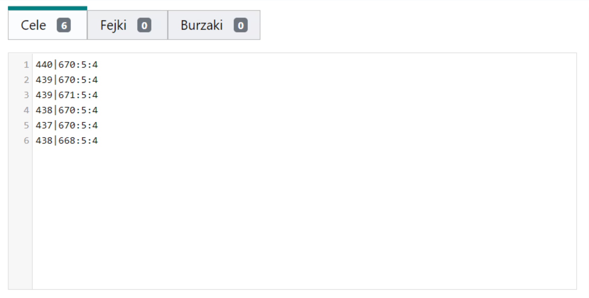
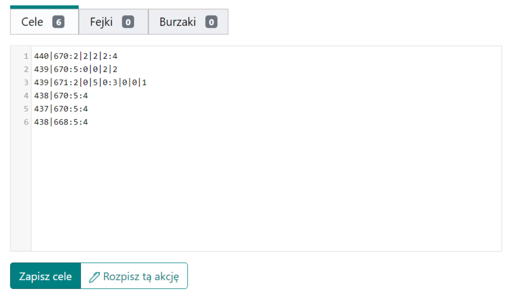
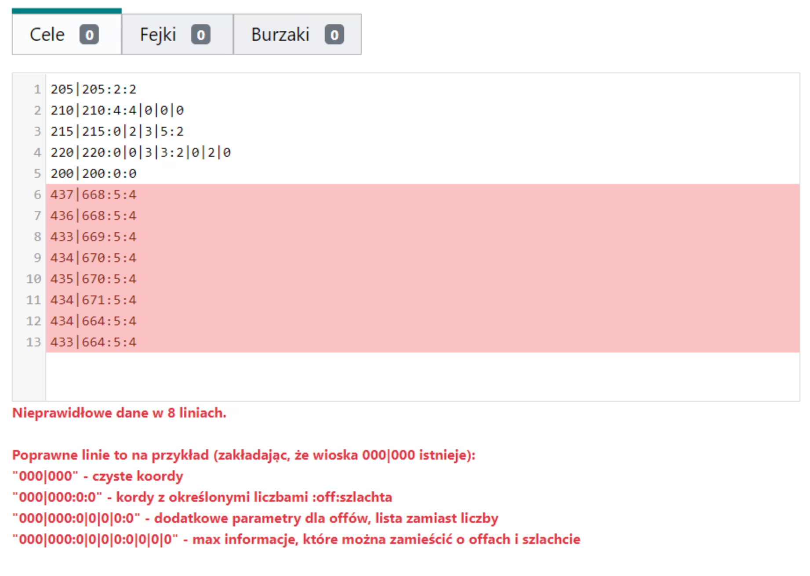

# Escreva os alvos do plano

Convenção: os alvos de ação subsequentes devem ser inseridos em linhas consecutivas de Alvos. No mínimo, apenas as coordenadas são suficientes, nesse caso, uma linha de exemplo `000|000` será completada para `000|000:0:0`. Mais tarde, você aprenderá como codificar o número de ofensas e nobres. Para salvar os alvos, clique em Salvar alvos.

<figure markdown="span">
  { width="600" }
  <figcaption>Exemplo 1, ofensas e nobres codificados por padrão</figcaption>
</figure>

`440|670:5:4` na primeira linha é um exemplo de como codificar o número de ofensas e nobres para um determinado alvo por padrão. O primeiro número indica o número de ofensas e o segundo número indica o número de nobres.

O Planejador suporta três tipos de alvos: real, falso e demolição. Coloque alvos reais em Alvos, alvos falsos em Falsos e alvos de demolição em Demolições. Para Falsos, em vez de ofensas e nobres, codifique o número de falsos e nobres falsos, e na aba Demolições, codifique o número de ofensas e o número de demolições (que seguem as ofensas).

<figure markdown="span">
  { width="600" }
  <figcaption>Exemplo 2, codificação estendida de ofensas e nobres</figcaption>
</figure>

Por padrão, alvos como no Exemplo 1 herdam o modo de envio da aba 3. Parâmetros de agendamento, como ofensas aleatoriamente da retaguarda e nobres da frente mais próxima. Se quisermos enviar, por exemplo, 5 ofensas aleatoriamente da retaguarda, 2 ofensas da retaguarda próxima, 1 nobre de longe e os últimos 3 nobres de perto para um determinado alvo, por exemplo, linha número 3 no Exemplo 2, que é `439|671`, podemos usar a sintaxe estendida inserindo:

```
439|671:2|0|5|0:3|0|0|1
```

Neste caso, em vez de um único número de ofensas, inserimos 2|0|5|0, e em vez de um único número de nobres, inserimos 3|0|0|1. Usamos a sintaxe estendida quando queremos algumas ordens de longe e outras de perto; existem 4 regiões da nossa tribo para escolher.

!!! info

    **A|B|C|D** se traduz em:
    A de perto|B da retaguarda próxima|C aleatoriamente da retaguarda|D de longe

Erros aparecerão em casos padrão, principalmente quando a aldeia fornecida não existe no mundo declarado no agendamento, ou quando a aldeia é bárbara, e quando os caracteres inseridos após as coordenadas não estão entre as possibilidades listadas acima. Não há obstáculos para que os alvos sejam aldeias de membros da tribo ou para que as mesmas aldeias sejam inseridas várias vezes (embora, neste caso, uma mensagem aparecerá no topo indicando que duplicatas foram detectadas). Duplicatas não são proibidas; cada alvo inserido, mesmo que apareça várias vezes, será tratado separadamente. No entanto, isso pode causar caos entre os jogadores porque haverá, por exemplo, vários dos mesmos alvos com ordens diferentes para eles (?). Duplicatas em abas diferentes (Alvos, Falsos, Demolições) não são contadas.

<figure markdown="span">
  { width="600" }
  <figcaption>Exemplo 3, erros durante o salvamento</figcaption>
</figure>
