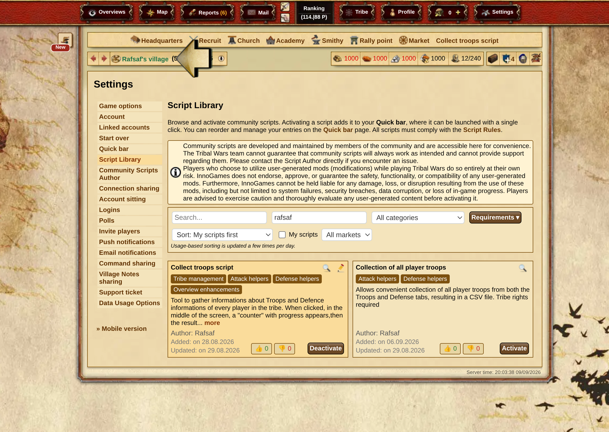

## Instalação

Atualmente, a única opção de instalação suportada é usar a **Biblioteca Oficial de Scripts** (Configurações -> Biblioteca de Scripts). Procure por ele pelo autor – Rafsaf ou pelo nome.



| Servidor           | Nome na biblioteca de scripts  | Autor  | Código                                                                                                                           |
| ------------------ | ------------------------------ | ------ | -------------------------------------------------------------------------------------------------------------------------------- |
| plemiona.pl        | Zbiórka Wojska i Obrony        | Rafsaf | [Código no GitHub (v20260218)](https://github.com/rafsaf/scripts_tribal_wars/blob/2026-02-18/public/collect_troops_v20260218.js) |
| tribalwars.net     | Collect troops script          | Rafsaf | [Código no GitHub (v20260218)](https://github.com/rafsaf/scripts_tribal_wars/blob/2026-02-18/public/collect_troops_v20260218.js) |
| guerretribale.fr   | Script de collecte des troupes | Rafsaf | [Código no GitHub (v20260218)](https://github.com/rafsaf/scripts_tribal_wars/blob/2026-02-18/public/collect_troops_v20260218.js) |
| tribals.it         | Raccolta delle truppe          | Rafsaf | [Código no GitHub (v20260218)](https://github.com/rafsaf/scripts_tribal_wars/blob/2026-02-18/public/collect_troops_v20260218.js) |
| guerrastribales.es | Script de colector de tropas   | Rafsaf | [Código no GitHub (v20260218)](https://github.com/rafsaf/scripts_tribal_wars/blob/2026-02-18/public/collect_troops_v20260218.js) |
| outros servidores  | -                              | -      | [Código no GitHub (v20260218)](https://github.com/rafsaf/scripts_tribal_wars/blob/2026-02-18/public/collect_troops_v20260218.js) |

!!! warning

    O script está disponível em muitas versões de idioma – relate o problema por meio do suporte do seu servidor para que ele possa ser adicionado lá, se não estiver listado acima. O uso em outras versões de idioma do jogo **onde o script não é permitido** pelo suporte pode resultar na suspensão da conta. Use por sua conta e risco.

=== "Servidores suportados"

    Instalação apenas pela biblioteca de scripts!

=== "Outros servidores"

    ```title="Roteiro de Coleta de Exército e Defesa"
    --8<-- "army_script_latest.txt"
    ```

## Instruções de Uso

1. Crie um roteiro para a barra de acesso rápido, vá para a visão da tribo e clique nele
2. Altere as configurações (opcionalmente) e pressione Executar
3. Aguarde o resultado
4. Vá para o plano selecionado
5. Cole os dados e confirme

Configurações:


Resultado:


## Descrição

Após clicar, um "contador" com o progresso aparece no centro da tela, seguido do resultado em uma janela. Funciona tanto na aba Exército quanto na aba Defesa. As configurações padrão para cópia têm `Cache` ativado e `Cache time` definido como 5 minutos. Durante esse tempo, o roteiro exibe o resultado salvo no navegador em vez de percorrer todos os membros novamente e coletar os dados. Em caso de dúvida se estamos lidando com um resultado novo ou antigo, a data da coleta aparece na parte inferior.

Os dados gerados pela execução do roteiro devem ser colados no plano no site.

Opções:

- **Cache**: <boolean> (padrão: `true`) é responsável por armazenar o resultado no navegador para não clicar acidentalmente várias vezes seguidas e sobrecarregar os servidores do jogo. Se o valor for `false`, o roteiro não salvará o resultado no navegador (útil, por exemplo, quando você pretende coletar dados de duas tribos e pular imediatamente para a outra). Observe que, se a tribo tiver um número muito grande de aldeias, isso pode ocupar muito espaço no `localStorage` (~máx 5MB), então o limite é de 1MB. Se a saída for > 1MB, o salvamento no `localStorage` será ignorado.

- **Tempo de cache**: <number> (padrão: `5`) é o tempo de armazenamento do resultado gerado no navegador, em minutos.

- **Jogadores excluídos**: <string> (padrão: `""`) aqui você insere os apelidos dos jogadores dos quais não deseja coletar dados de visão geral, separados por ponto e vírgula como nas mensagens, por exemplo, "Rafsaf;kmic;alguém".

- **Jogadores permitidos**: <string> (padrão: `""`) aqui você insere os apelidos dos jogadores dos quais SOMENTE deseja coletar dados de visão geral. Os demais serão ignorados, com os apelidos separados por ponto e vírgula como nas mensagens, por exemplo, "Rafsaf;kmic;alguém". Observação: o valor padrão `""` tem um significado especial e indica que você deseja coletar dados de visão geral de todos os jogadores.

- **Mostrar nicks**: <boolean> (padrão: `false`) quando o valor é `true`, o apelido do jogador é adicionado a cada linha do resultado da coleta de Exército, semelhante ao mesmo item na aba Defesa.

- **Mostrar primeira linha**: <boolean> (padrão: `false`) quando o valor é `true`, um cabeçalho é adicionado ao topo do resultado da coleta de Exército, cujo valor é definido no próximo parâmetro, `Texto da primeira linha`.

- **Texto da primeira linha**: <string> (padrão: `""`) o valor que será adicionado ao cabeçalho no resultado da coleta de Exército se `Mostrar primeira linha` estiver definido como `true`.

- **Mostrar nicks**: <boolean> (padrão: `false`) quando o valor é `true`, o apelido do jogador é adicionado a cada linha do resultado da coleta de Defesa, semelhante ao mesmo item na aba Exército.

- **Mostrar primeira linha**: <boolean> (padrão: `false`) quando o valor é `true`, um cabeçalho é adicionado ao topo do resultado da coleta de Defesa, cujo valor é definido no próximo parâmetro, `Texto da primeira linha`.

- **Texto da primeira linha**: <string> (padrão: `""`) o valor que será adicionado ao cabeçalho no resultado da coleta de Defesa se `Mostrar primeira linha` estiver definido como `true`.
