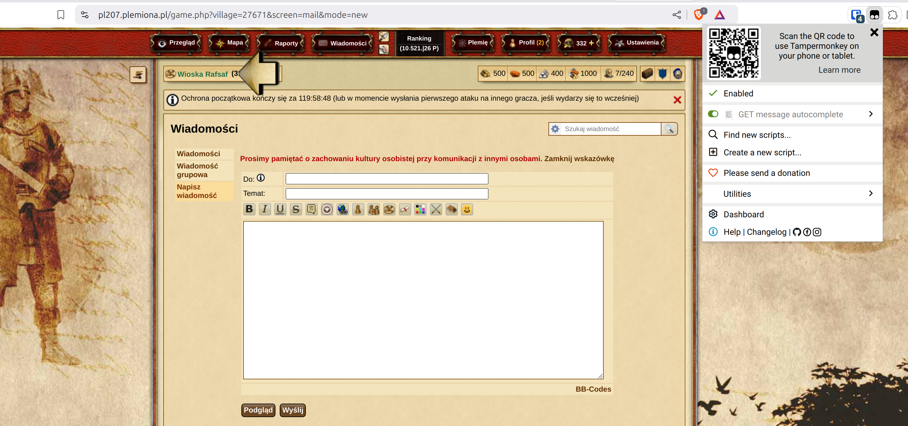

# Roteiro para envio de mensagens

| Servidor          | Fórum do Tribal Wars                                                                                                                                                                     | Permitido                    | Código                                                                                                                                  |
| ----------------- | ---------------------------------------------------------------------------------------------------------------------------------------------------------------------------------------- | ---------------------------- | --------------------------------------------------------------------------------------------------------------------------------------- |
| plemiona.pl       | [https://forum.plemiona.pl/index.php?threads/auto-uzupe%C5%82nianie-wiadomo%C5%9Bci.128461/](https://forum.plemiona.pl/index.php?threads/auto-uzupe%C5%82nianie-wiadomo%C5%9Bci.128461/) | SIM                          | [Código no GitHub (v2.0)](https://github.com/rafsaf/scripts_tribal_wars/blob/2024-09-01/public/GET_message_autocomplete.js)             |
| outros servidores | -                                                                                                                                                                                        | NÃO (não pode ser detectado) | [Código no GitHub (v2.2)](https://github.com/rafsaf/scripts_tribal_wars/blob/2025-09-22/public/GET_message_autocomplete_v2.2_global.js) |

!!! warning

    O uso em outras versões de idioma do jogo **onde o roteiro não é permitido** é por sua conta e risco. O roteiro é permitido na versão em polonês e sua operação é completamente indetectável, mas para outras versões de idioma do jogo (por exemplo, tcheco, global), eles são sempre ilegais.

=== "plemiona.pl"

    ```title="Roteiro de Preenchimento Automático de Mensagem"
    --8<-- "sending_messages_script_plemiona_pl.txt"
    ```

=== "outros servidores"

    ```title="Roteiro de Preenchimento Automático de Mensagem"
    --8<-- "sending_messages_script_global.txt"
    ```

## Instalação

Para usar os roteiros, você deve primeiro instalar a extensão de navegador apropriada (monkey):

- [Tampermonkey](https://www.tampermonkey.net/) (Chrome, Opera, Microsoft Edge, Safari, Firefox)
- [Greasemonkey](https://addons.mozilla.org/pl/firefox/addon/greasemonkey/) (Firefox)

Em seguida, crie um novo roteiro de usuário e cole o código abaixo.

Para usar o roteiro no Tampermonkey, você deve habilitar a opção "Permitir Roteiros de Usuário" ou ativar o Modo de Desenvolvedor.
Consulte [https://www.tampermonkey.net/faq.php#Q209](https://www.tampermonkey.net/faq.php#Q209).

## Como verificar se a extensão está funcionando

Vá para "Correio" -> "Escrever Mensagem" em qualquer mundo.

Certifique-se de que a extensão Tampermonkey está ativada e a extensão "GET message autocomplete" está ativa.



## Instruções de Uso

1. Vá para a aba Resultados do plano concluído, [veja este capítulo sobre a aba de resultados](./../first_steps/step_7_results_tab.md)
2. Clique em {==Enviar==} para abrir novas abas no jogo
3. Envie a mensagem no jogo
4. Na página, o texto mudará para "Enviado!", continue

## Descrição

Um roteiro de navegador simples e curto que preenche os campos **"Para"**, **"Assunto"** e **"Conteúdo da Mensagem"** em uma nova mensagem se eles forem fornecidos no link. Ele automatiza o envio de mensagens para jogadores após o agendamento no site, detectando o roteiro e sua execução apenas na nova aba de mensagem. Um exemplo de uso pode ser encontrado abaixo.

- to - destinatário
- subject - assunto
- message - mensagem

Exemplo:

```
https://pl155.plemiona.pl/game.php?screen=mail&mode=new#to=AlgumJogador&subject=Titulo&message=Conteudo
```


